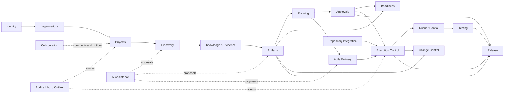
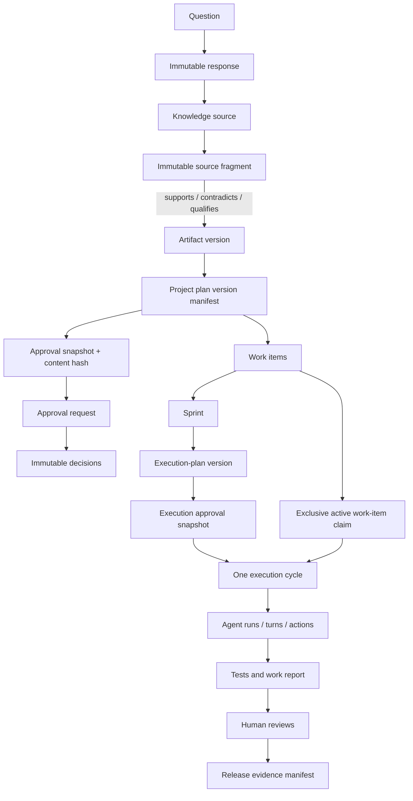
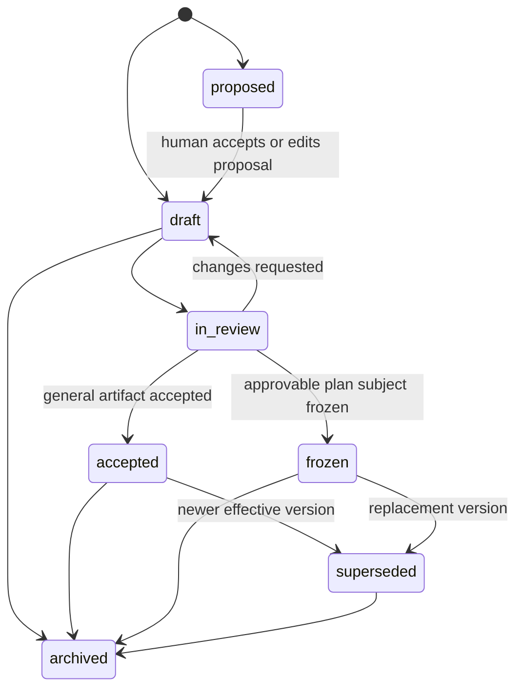
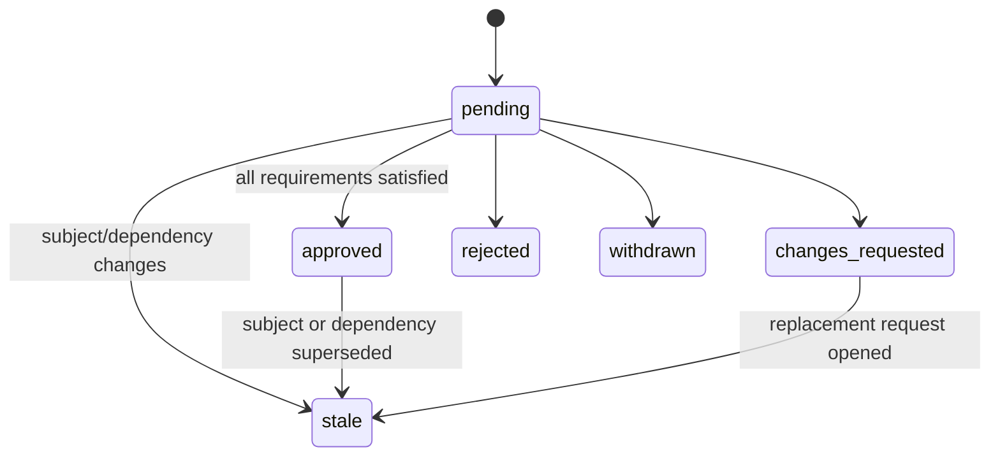
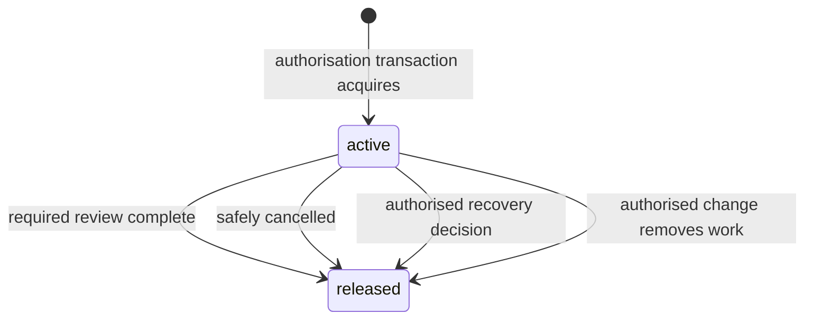
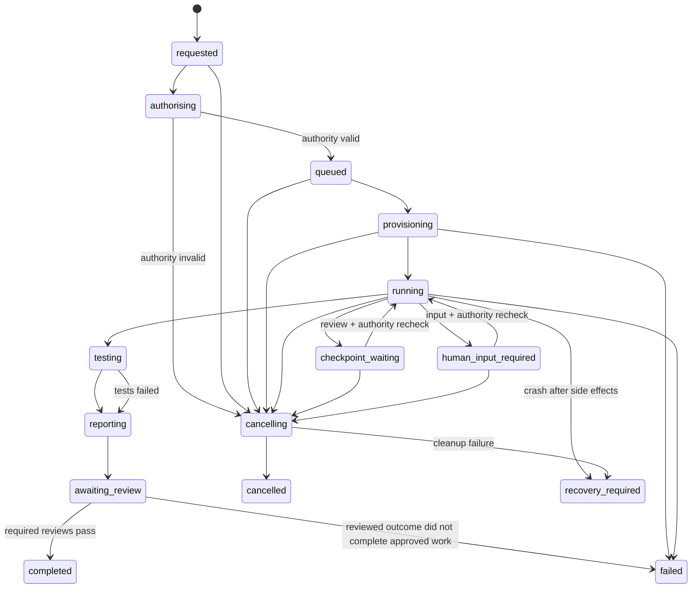
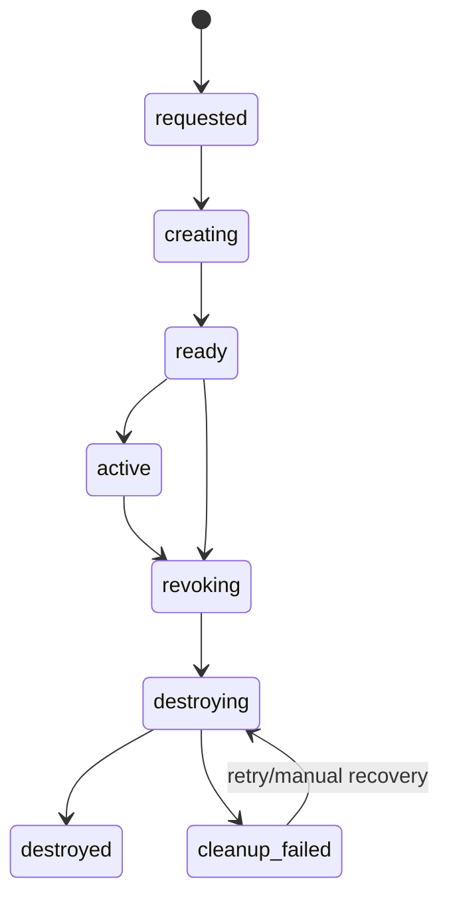
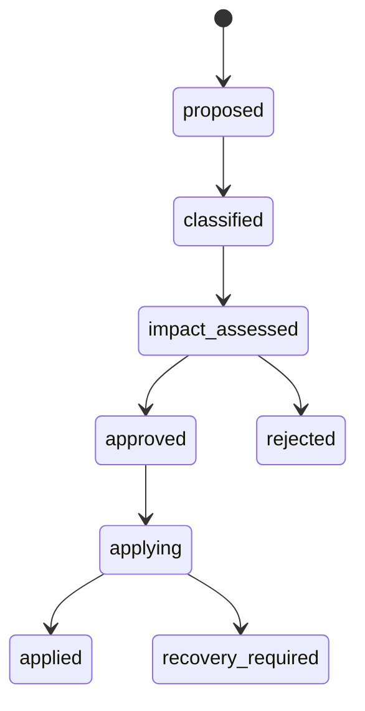

# Domain Model

Status: Proposed
Canonical terminology source for modules, aggregates, state ownership, and business invariants

## Glossary

| Term | Definition |
|---|---|
| Organisation | Security and ownership tenant. Every company-controlled record belongs directly or indirectly to one organisation. |
| Project | Bounded body of discovery, planning, delivery, execution, review, and release work. |
| Guest | Project-scoped external participant who has no implicit organisation administration or discovery rights. |
| Origin | How content was created: `human_authored`, `ai_generated`, `ai_generated_human_edited`, `imported`, or `system_generated`. |
| Knowledge source | Container describing where original information came from. |
| Source fragment | Immutable excerpt or statement from a source; corrections supersede rather than mutate it. |
| Artifact | Stable identity for important project knowledge with immutable numbered versions. |
| Artifact version | Exact immutable content and structured type data at a point in time. |
| Evidence link | Typed relationship from an exact source fragment to an exact artifact version. |
| Project plan | Versioned artifact whose dependency manifest selects exact requirements, assumptions, risks, decisions, acceptance criteria, and designs. |
| Approval snapshot | Immutable canonical representation of an approvable subject version and dependencies, identified by SHA-256 content hash. |
| Project approval | Authenticated operational decision against an approval snapshot. |
| High-Assurance project approval | Operational approval with stronger reauthentication, distinct-person, and separation-of-duty rules; not a Legal electronic signature. |
| Legal electronic signature | Future optional legal ceremony; not an initial product dependency. |
| Readiness result | Deterministic evaluation of named rules; optional numeric completion is descriptive, not authority. |
| Work item | Hierarchical Agile delivery unit linked to exact requirement and acceptance-criterion versions. |
| Execution work-item claim | Exclusive active domain record connecting one work item to one execution cycle. It has no time-based expiry, is acquired by the application during authorisation, and is not controlled by Codex. |
| Execution plan | Stable identity for a versioned proposed unit of Codex work. |
| Execution-plan version | Immutable objective, scope, repository, commit, branch, permissions, limits, tests, stop conditions, and review requirements. |
| Execution cycle | One authorised attempt to perform one approved execution-plan version. |
| Runner capability grant | Revocable, expiring server-side authority record whose raw opaque token is shown only to one runner environment. |
| Runner environment | Isolated compute/workspace instance that checks out and executes the approved repository scope. |
| Agent run | One runner-managed Codex process/thread session within a cycle. |
| Agent turn | One bounded continuation within an agent run. |
| Agent action | Requested or completed tool/command/file/network operation, including denied actions. |
| Checkpoint | Planned or emergent stop that requires recorded human input/review before resumption. |
| Work report | Structured outcome, changes, tests, limitations, usage, stop reason, and next actions from a cycle. |
| Demonstration comparison | Versioned synthetic evaluation pairing a direct-to-Codex baseline with the platform-assisted evidence chain; its final result is immutable and never grants execution authority. |
| Release | Immutable evidence-oriented record of selected requirements/work, validation, limitations, reviews, and approval. |
| Prohibited-content incident | Restricted metadata and response workflow for suspected patient-identifiable health information; it does not reproduce that content. |

## Bounded modules

The application is a modular monolith. Modules communicate through application services, domain interfaces, and committed domain events; they do not query another module’s tables directly.

| Module | Responsibilities | May depend on |
|---|---|---|
| Identity | Users, Better Auth adapter, magic-link/passkey/TOTP authenticators, database sessions, app-owned reauthentication grants, revocation, internal application principals | Platform reliability |
| Organisations | Organisations, memberships, teams, invitations | Identity, audit |
| Projects | Projects, project membership, roles, mode, repositories | Organisations, identity |
| Workflow | Definition/version, instances, states, transitions | Projects, approval/readiness interfaces |
| Discovery | Questions, assignments, immutable responses, follow-ups | Projects, collaboration, AI proposals |
| Knowledge & Evidence | Sources, immutable fragments, typed relationships, provenance | Projects, attachments |
| Artifacts | Artifacts, versions, typed extensions, relationships | Evidence, projects |
| Planning | Project plans and dependency manifests | Artifacts, workflow |
| Approvals | Policies, requirements, immutable snapshots, requests, immutable decisions, request staleness | Identity, projects; references versioned subjects |
| Readiness | Deterministic criteria and evaluations | Artifacts, approvals, risks, workflow |
| Agile Delivery | Iterations, hierarchical work items, dependencies, assignment | Artifacts, projects |
| AI Assistance | Prompt/model profiles, proposals, generation jobs, evaluations, usage, synthetic demonstration comparisons | Discovery, artifacts, Agile through ports; read-only execution/testing projections for comparison |
| Repository Integration | GitHub installations, repositories, webhooks, branches, PR/check data | Projects, platform reliability |
| Execution Control | Execution plans/versions, cycles, policies, capabilities, checkpoints, usage, reports, reviews | Approvals, Agile, repository, testing |
| Runner Control | Isolated environment lifecycle and runner protocol | Execution Control only through explicit contracts |
| Testing | Test cases, runs, results, evidence | Execution Control, repository |
| Change Control | Change proposals, classification, impact graph, application | Artifacts, planning, Agile, execution, approvals |
| Release | Releases, included versions, limitations, verification, approval | Artifacts, Agile, execution, testing, approvals |
| Collaboration | Comments, mentions, notifications, activity | Identity, projects |
| Attachments | Object metadata, signed access, scan/quarantine status | Projects, security |
| Security & Privacy | Prohibited-content incidents, retention, export/deletion controls | Identity, projects, attachments, audit |
| Platform Reliability | Audit, inbox, outbox, idempotency, scheduled jobs, observability metadata | None |

### Initial versus later modules

All modules above are initial except that teams are minimal, workflow authoring is limited to stored presets, AI provider selection is OpenAI-first, repository integration is GitHub.com-only, and release management records evidence without deploying software.

Later optional modules include portfolio management, visual workflow design, Waterfall/hybrid templates, Slack/Teams/calendar/storage connectors, GitHub Enterprise/GitLab adapters, enterprise identity/provisioning, managed multi-region operations, regulated-health support, and the Legal electronic signature module.

## Aggregate ownership

### Organisation and project

- `Organisation` owns membership and policy administration.
- `Project` owns project mode, data classification, lifecycle, project membership, workflow instance, and repository mappings.
- A project’s `organisation_id` cannot change. Migration between organisations is export/import, not an update.
- Guests require explicit project membership and grants.
- An application-owned `ReauthenticationGrant` proves a fresh passkey user-verification ceremony for one principal, exact action, and subject/snapshot hash for no more than 15 minutes. It is distinct from the Better Auth session and cannot broaden membership or permission.

### Discovery and knowledge

- `Question` owns prompt text, origin, status, assignments, and follow-up relationships.
- `QuestionResponse` is immutable after submission. Drafts are mutable with optimistic concurrency; submission creates the immutable record. A correction uses `supersedes_response_id`.
- `KnowledgeSource` owns descriptive provenance. `SourceFragment` is immutable original evidence.
- A contradiction never edits either statement. It is a typed relationship with rationale and actor.

### Artifacts and plans

- `Artifact` is a stable identity with type and lifecycle.
- `ArtifactVersion` owns immutable common content, origin, author, version number, and hash. One typed extension owns structured fields for that version.
- Relationships are version-to-version when meaning depends on content. Stable artifact relationships are used only for navigation and cannot prove approval/evidence.
- `ProjectPlanVersion` is a typed artifact version with an immutable dependency manifest. It never means “latest requirement”; it lists exact version IDs and hashes.

### Approvals

- `ApprovalPolicyVersion` owns rule definitions.
- `ApprovalSnapshot` owns the canonical approvable payload and dependency manifest.
- `ApprovalRequest` owns evaluated requirements and request state.
- `ApprovalDecision` is immutable and belongs to one evaluated requirement and snapshot.
- `ApprovalRevocation` is an immutable current-authority invalidation; it never rewrites the request result or decision and continuing requires a new request.
- The Approval module can determine current validity but cannot mutate an approved subject.
- A Legal electronic signature, if later added, consumes the same immutable snapshots but remains a separate module; the Approval module has no dependency on it.

### Agile

- `Iteration` owns sprint goal, dates, state, selected work, and optional approval subject.
- `WorkItem` owns kind, parent, status, ordered priority, assignees, version links, and dependencies.
- Work is complete only when linked acceptance criteria and required review/test evidence are satisfied.

### Execution control and runner

- `ExecutionPlan` owns immutable `ExecutionPlanVersion` records.
- An `ExecutionPlanVersion` links exact project-plan/artifact versions, work items, repository, approved commit, branch strategy, scope, limits, tests, and review rules.
- `ExecutionCycle` owns the authoritative lifecycle. A unique invariant allows at most one cycle per execution-plan version.
- `ExecutionWorkItemClaim` owns exclusive active use of one work item by one cycle. All selected claims are acquired in the authorisation transaction; the active uniqueness invariant is scoped by organisation/work item, not execution-plan version.
- `RunnerCapabilityGrant` is the sole runner authority record; its raw token is never persisted.
- `RunnerEnvironment` owns compute/workspace lifecycle but cannot widen policy.
- `AgentRun`, `AgentTurn`, and `AgentAction` record execution hierarchy and outcomes.
- `ExecutionCheckpoint` and `ExecutionReview` own human control points.
- `ExecutionWorkReport` is structured and immutable per revision; corrections add a superseding report.

The canonical persistence names for this aggregate are `execution_plans`, `execution_plan_versions`, `execution_cycles`, `execution_cycle_work_items`, `execution_work_item_claims`, `runner_capability_grants`, `runner_environments`, `agent_runs`, `agent_turns`, `agent_actions`, `execution_checkpoints`, `execution_usage_events`, `execution_test_runs`, `execution_work_reports`, `execution_reviews`, `code_changes`, and `changed_files`. These names are normative across API projections, jobs, audit subjects, tests, and operational runbooks; [03-data-model.md](./03-data-model.md) defines their columns and constraints.

Claims remain active throughout `queued`, `provisioning`, `running`, `checkpoint_waiting`, `human_input_required`, `testing`, `reporting`, and `awaiting_review`. Release is permitted only after required review completes, safe cancellation completes, an authorised recovery decision confirms capability/environment containment before releasing failed work, or an authorised change both removes the work item and safely stops/contains the affected cycle. `recovery_required` never releases a claim implicitly. Acquisition, conflict, and release are audited and published through the outbox. Repository-path overlap detection is an advisory warning/future extension and cannot replace the work-item constraint.

### Change and release

- `ChangeProposal` owns proposed classification, confirmed classification, rationale, impact graph, and decision.
- Applying an accepted change is an application service transaction across new versions and staleness markers, coordinated by events where atomic cross-aggregate work is not practical.
- `Release` owns a versioned release record and exact inclusion/evidence manifest. Release approval targets its immutable snapshot.

### Demonstration comparison

- `DemonstrationComparison` identifies the synthetic scenario, fixture version, original-idea baseline input, and exact platform-assisted plan/execution/release manifests.
- `DemonstrationComparisonResult` is immutable and records unsupported assumptions, missing requirements/questions/acceptance criteria, requested corrections, discovered/prevented items, coverage, stakeholder-confidence evidence, and traceability measures for both arms.
- The direct-to-Codex arm runs only in the dedicated synthetic demo tenant and fixture repository. It cannot mint a runner capability, write project authority, or bypass the standard execution workflow.

## Module relationship diagram

## Core relationships

## State machines

The canonical project workflow state for plan review is `plan_in_review`. The full project-facing sequence is `discovery`, `planning`, `plan_in_review`, `ready_for_backlog`, `delivery`, `release_in_review`, `released`, with `on_hold` and `archived` as controlled alternatives.

### Artifact lifecycle

`accepted` and `frozen` are content-lifecycle states, not Project approval decisions. Project approval is represented only by the separate immutable snapshot/request/decision model.

### Approval request lifecycle

Approval decisions and approval snapshots themselves do not transition. They are immutable facts. A relevant change marks the request `stale` and invalidates the old snapshot’s use as current authority.

### Execution work-item claim lifecycle

`active` is derived from `released_at IS NULL`; it is not a mutable status string. Checkpoint, human-input, testing, reporting, awaiting-review, and recovery-required cycle states retain the claim. A recovery-required claim needs an explicit authorised recovery decision.

### Execution cycle lifecycle

### Runner environment lifecycle

### Change proposal lifecycle

## Business invariants

### Tenancy and authorisation

1. Every tenant-controlled aggregate has immutable `organisation_id`.
2. A tenant-controlled foreign key includes and matches `organisation_id`.
3. Application permission and RLS must both permit tenant access.
4. A guest sees only explicit project resources and assignments.
5. Actor identity, effective role/authority, and tenant context are captured on material audit events.

### Evidence and artifacts

6. Submitted evidence is never edited or ordinarily deleted; corrections supersede it.
7. Evidence relationships point to immutable source fragments and artifact versions.
8. AI output begins as a proposal and cannot silently become a confirmed fact or human-authored record.
9. An artifact version’s canonical content and content hash never change.
10. An approved plan refers to exact versions, never “current” records.

### Approvals and readiness

11. A decision applies to one exact snapshot and evaluated requirement.
12. A newer relevant version marks the earlier request stale; it never deletes or rewrites decisions.
13. A person cannot satisfy distinct-principal requirements twice.
14. AI, system, integration, and operator actors cannot approve project content.
15. Readiness advice cannot override a missing required operational approval.

### Execution

16. `execution_plan_version_id` is unique in `execution_cycles`.
17. For each work item, at most one `execution_work_item_claims` row may have `released_at IS NULL` in an organisation.
18. A cycle cannot leave `authorising` without current plan approval, current authority, valid repository access, an unused execution-plan version, and atomic acquisition of every selected work-item claim.
19. Claim conflict fails authorisation without a partial claim set; claim acquisition/release writes domain state, audit, and outbox atomically.
20. A claim remains active through checkpoint, human input, testing, reporting, and required review; `recovery_required` cannot release it implicitly.
21. Only required-review completion, safe cancellation, an authorised failure-recovery decision, or an authorised change removing work may release a claim.
22. A runner cannot widen its capability and cannot receive secrets outside its grant.
23. Starting and resuming require a fresh authority recheck.
24. Denied actions are evidence, not silent retries or automatic scope expansion.
25. A cycle cannot be `completed` while tests/reviews are missing, failed, or pending.
26. Revocation stops future authority immediately while preserving historical actions and decisions.

### Health-data boundary

27. Initial project classification is `general_business`; regulated health information is unsupported.
28. Suspected prohibited content is not copied into audit messages, notifications, AI prompts, or diagnostic logs.
29. Detection warnings do not claim that the system can guarantee absence of health information.

### Change and release

30. Highest matching change class wins; AI can recommend but an authorised human confirms.
31. Fundamental change returns the project to discovery and blocks dependent execution.
32. A release record includes exact evidence versions and cannot claim completion without required tests/reviews/approvals.

## Fixed versus configurable behaviour

Fixed product invariants include tenancy, immutable evidence/versions/snapshots/decisions, request-owned staleness, snapshot-bound approval, actor restrictions, runner authority, one-cycle-per-plan-version, one active execution claim per work item, audit/outbox atomicity, and completion gates.

Configurable versioned behaviour includes named workflow states presented to users, allowed non-security transitions, approval roles/users, role aggregation, distinct-person requirements, readiness criteria, required review stages, execution limits, notification routing, and retention within safe operator limits. Operator runtime configuration includes `runner_graceful_shutdown_seconds`, default `30` and constrained to `5`–`120`; changing it never delays capability or secret revocation. Configuration cannot disable fixed invariants.
