# PostgreSQL Data Model

Status: Proposed implementation schema
Conventions: plural `snake_case` table/column names, application-generated UUIDv7 primary keys, `timestamptz`, UTF-8, explicit constraints

This document defines schema shape, not migration SQL. Drizzle models mirror reviewed SQL migrations; generated SQL is never applied without review.

## Cross-cutting conventions

### Tenant-owned tables

Every tenant-controlled table contains:

- `id uuid primary key`
- `organisation_id uuid not null`
- `created_at timestamptz not null`
- `created_by_actor_id uuid null` where creation has an actor
- `updated_at timestamptz` and `lock_version integer` only for mutable records
- `archived_at timestamptz` where archival is meaningful

Foreign keys between tenant-owned tables use `(organisation_id, referenced_id)` and reference a unique `(organisation_id, id)` key. This prevents cross-tenant references even if application checks fail.

### Mutable versus immutable records

- Draft containers, assignments, preferences, and workflow instances use optimistic `lock_version`.
- Submitted evidence, artifact versions, approval snapshots/decisions, execution events, test results, demonstration comparison results, release versions, audit events, and inbox/outbox payloads are append-only.
- Corrections use `supersedes_*_id`; revocation/staleness is represented in owning lifecycle records or separate events.

Origin-bearing records constrain `origin` to `human_authored`, `ai_generated`, `ai_generated_human_edited`, `imported`, or `system_generated`. Accepting or editing an AI proposal creates the appropriate target record with actor attribution plus an immutable provenance link to its `ai_output_id`, prompt/model/schema version and input-manifest lineage; it never converts origin to `human_authored` and can never create an `approval_decision`.

### Canonical hashing

Approval and important version hashes use SHA-256 over an RFC 8785 canonical JSON payload. Text normalises line endings to LF before canonicalisation. The payload includes schema version, subject kind/ID/version, content, and dependency IDs/hashes. Hash algorithms and canonical schema versions are stored with the hash.

## Identity and tenancy

### Global identity tables

Better Auth `1.6.23` is the selected authentication adapter, with every Better Auth core/plugin package pinned to that same patch. It is mounted directly on Fastify and uses its reviewed Drizzle/PostgreSQL schema with database-backed sessions; cookie session caching is disabled so a database revocation is effective on the next authenticated request. The names below are the application’s canonical logical mappings around the generated Better Auth schema. Migration generation pins and contract-tests the exact physical table/column mapping and enabled magic-link, passkey, and TOTP plugin tables; that mechanical verification is not an unresolved provider-selection decision. Identity repositories convert the verified adapter session into an internal application principal; no application permission or RLS policy queries Better Auth tables directly.

| Table | Important columns and constraints |
|---|---|
| `users` | `id`, unique case-folded `email`, `display_name`, `status`, `email_verified_at`, `created_at`, `disabled_at`; no `organisation_id` because identity is global |
| `auth_accounts` | `user_id`, provider, provider account ID, credential metadata; unique provider/account |
| `auth_sessions` | Better Auth database-authoritative session row including its documented lookup token, `user_id`, expiry, creation/update times, IP/user-agent metadata and revocation state supported by the adapter; indexed by user and expiry; browser cookie cache disabled. The lookup token is the explicit narrow exception to digest-only bearer-token storage and receives restricted-column access, encrypted storage/backup controls, redaction, and secret-scanning tests |
| `authenticators` | Better Auth first-party plugin mappings for `passkey` and `totp`, including public/verification metadata, created/last-used/revoked times; TOTP/recovery secret material encrypted at rest |
| `verification_tokens` | magic-link/email-verification/recovery purpose, hashed token verifier, subject, expiry, consumed time; magic link config uses `storeToken: 'hashed'`; atomic single-use unique constraint |

### Organisation/project tables

| Table | Important columns and constraints |
|---|---|
| `organisations` | `id`, unique slug, name, status, default timezone, retention profile ID, created/archived times |
| `organisation_memberships` | `organisation_id`, `user_id`, status, joined/left times; unique active organisation/user |
| `organisation_role_assignments` | membership ID, role, optional effective/expiry times; tenant-aware FK |
| `teams` | minimal initial name/description/status |
| `team_memberships` | team ID, organisation membership ID; unique team/member |
| `invitations` | organisation/project scope, case-folded email, role/grants JSON, hashed token, expiry, consumed/revoked times, inviter; one active token identity |
| `projects` | organisation, key, name, description, mode (`light`, `standard`, `high_assurance`), `data_classification` constrained initially to `general_business`, status, workflow instance, timezone; unique organisation/key |
| `project_memberships` | project, `user_id`, membership type (`member`, `guest`), status, joined/left times; unique active project/user. A guest is a global authenticated user with project-only membership and no implied organisation membership |
| `project_role_assignments` | membership, role, scope JSON, effective/expiry times |
| `project_permission_grants` | membership, permission, optional object/stage scope; explicit guest grants |
| `reauthentication_grants` | organisation, optional project, `user_id`, originating auth session, action key, subject kind/ID and snapshot/content hash, method constrained initially to `passkey_uv`, issued/expires/consumed/revoked times, nonce hash; one-use; `expires_at <= issued_at + interval '15 minutes'`; tenant-aware target FKs |

An invitation token is never stored raw. Acceptance atomically consumes the token and creates/activates the intended membership and audit/outbox records.

Better Auth `updateAge` extends session expiry and is not token rotation. Credential recovery, privilege elevation, and configured security-boundary changes revoke the old database session and require a fresh authenticated session. Passwordless magic-link sign-in is not assumed to invoke TOTP automatically. A High-Assurance command consumes a separate `reauthentication_grants` row created only after a fresh passkey user-verification ceremony; the grant is bound to the exact action and subject/snapshot hash and cannot outlive 15 minutes.

## Workflow

| Table | Important columns and constraints |
|---|---|
| `workflow_definitions` | stable identity, owner (`system` or organisation), key, name, methodology |
| `workflow_versions` | definition, version number, immutable status/configuration, content hash, published time; unique definition/version |
| `workflow_states` | workflow version, key, label, category, order, terminal flag; unique version/key |
| `workflow_transitions` | workflow version, key, from/to state IDs, command key, configured permission/policy references; no arbitrary code |
| `project_workflow_instances` | project, pinned workflow version, current state, lock version |
| `workflow_transition_events` | instance, from/to state, transition, actor, reason, correlation ID, created time; append-only |

Security/integrity prerequisites are evaluated in application code even when a configured transition exists.

The initial project workflow version constrains state keys to `discovery`, `planning`, `plan_in_review`, `ready_for_backlog`, `delivery`, `release_in_review`, `released`, `on_hold`, and `archived`; seed/configuration validation rejects every unregistered alias.

## Discovery, knowledge, and evidence

| Table | Important columns and constraints |
|---|---|
| `questions` | project, origin, author actor, prompt, rationale, status, parent/follow-up question, lock version; parent in same project |
| `question_assignments` | question, project membership, due time, status; unique active question/member |
| `question_response_drafts` | question, membership, mutable body, lock version, autosaved time; unique question/member |
| `question_responses` | question, respondent actor, immutable body, origin, submitted time, `supersedes_response_id`; superseded response must answer same question |
| `knowledge_sources` | project, source type, title, origin, author/importer, source time, attachment/external reference, immutable capture metadata |
| `source_fragments` | source, fragment kind, immutable text or object range, content hash, origin, captured time, `supersedes_source_fragment_id` |
| `source_fragment_relationships` | from/to fragment, relation (`supports`, `contradicts`, `qualifies`, `originates_from`), rationale, actor; fragments in same organisation/project |

Do not store “original evidence” as a mutable rich-text block. A response-to-source ingestion creates a knowledge source and immutable fragments; later correction creates new response/source/fragment records linked by supersession.

## Artifact model

### Common root

| Table | Important columns and constraints |
|---|---|
| `artifacts` | project, type, stable key, title, lifecycle, current version ID (navigation only), archived time; unique project/key |
| `artifact_versions` | artifact, version number, title, narrative Markdown, origin, author actor, canonical schema version/payload, content hash, created time, `supersedes_version_id`; unique artifact/version and artifact/hash |
| `artifact_version_state_events` | artifact version, sequence, state (`proposed`, `draft`, `in_review`, `accepted`, `frozen`, `superseded`, `archived`), actor/reason, created time; append-only, unique version/sequence |
| `artifact_version_relationships` | from/to exact versions, relation type, rationale, actor; unique meaningful edge |
| `artifact_version_evidence_links` | artifact version, source fragment, relation (`supports`, `contradicts`, `qualifies`, `originates_from`), rationale, link origin, confidence only for advisory display; exact immutable targets |

`artifacts.current_version_id` is a cached pointer and never used for approval/evidence proof. Relationships and manifests use exact version IDs.

Artifact content never mutates. The latest append-only state event is the lifecycle projection. General artifacts use `proposed → draft → in_review → accepted`; approvable plan subjects use `draft → in_review → frozen`; replacements append `superseded`. `accepted`/`frozen` are not approval decisions and do not authorise downstream action.

### Typed version extensions

Each extension uses `artifact_version_id` as its primary key and validates the root type in the domain service and migration tests.

| Table | Relational fields; narrative/detail JSONB only where noted |
|---|---|
| `requirement_versions` | requirement class, priority, verification method, owner role, status |
| `assumption_versions` | confidence, validation method, due date, resolution status |
| `risk_versions` | likelihood, impact, severity, owner role, response strategy, residual severity |
| `decision_versions` | decision status, decision date, decision owner, alternatives/criteria JSONB |
| `acceptance_criterion_versions` | criterion format, verification type, automatable flag |
| `plan_versions` | objective, intended users, success definition, dependency manifest JSONB, readiness-evaluation ID |
| `design_versions` | design type, structured references JSONB |
| `release_plan_versions` | release objective, target window, inclusion policy, rollback/communication summary |

JSONB is appropriate for immutable heterogeneous manifests, model/provider metadata, policy predicates, external webhook bodies, and presentation-specific detail. Tenant IDs, lifecycle states, permissions, version references, monetary/token limits, relationship endpoints, and fields used for filtering or constraints remain relational.

## Approval and readiness

| Table | Important columns and constraints |
|---|---|
| `approval_policies` | stable project/organisation identity, stage, name, active version pointer |
| `approval_policy_versions` | immutable numbered rules JSONB, mode/risk applicability, content hash, published time |
| `approval_snapshots` | subject kind, subject stable ID, subject version ID, schema version, canonical payload JSONB, dependency manifest JSONB, SHA-256 hash, created time; unique organisation/hash and unique subject-version/hash |
| `approval_requests` | snapshot, policy version, state (`pending`, `approved`, `changes_requested`, `rejected`, `withdrawn`, `stale`), requested/due/completed/stale times, stale reason, replacement request ID, lock version |
| `approval_requirements` | request, requirement key, authority predicate JSONB, minimum decisions, distinct-principal group, role aggregation flag, status; immutable after request opens |
| `approval_decisions` | request, requirement, snapshot, reviewer user/project membership, authority/roles at decision, decision enum, conditions JSONB, comment, decided time, reauthentication context; append-only |
| `approval_revocations` | approval request, optional exact decision, revoking actor, reason, effective time, replacement request nullable; append-only. A revocation invalidates future authority without deleting/changing the snapshot, request result, or decision |
| `approval_condition_resolutions` | decision/condition key, resolver, resolution/evidence, status, time; append-only resolutions |
| `readiness_rule_sets` | owner/stage/mode, stable key and active version |
| `readiness_rule_set_versions` | immutable deterministic rule definitions and content hash |
| `readiness_evaluations` | project, subject kind/version, rule-set version, state, evaluated time, input manifest/hash, optional completion percentage |
| `readiness_rule_results` | evaluation, rule key, severity (`blocking`, `warning`, `informational`), outcome, explanation, related entity/version IDs JSONB |

Database checks constrain `approval_requests.state` to `pending`, `approved`, `changes_requested`, `rejected`, `withdrawn`, or `stale`; and `approval_decisions.decision` to `approved`, `approved_with_conditions`, `changes_requested`, or `rejected`. A relevant change marks the approval request `stale` and invalidates the old snapshot’s use as current authority. The immutable snapshot and decisions remain unchanged as historical evidence. Revocation appends `approval_revocations`; it is a current-authority invalidation, not an extra request/decision state. A decision must reference the same snapshot and request requirement, and its reviewer membership must belong to the request project/organisation.

There are no initial-release `legal_signature_*` tables. A future Legal electronic signature module may reference `approval_snapshots` but cannot alter core approval decisions.

## Agile delivery

| Table | Important columns and constraints |
|---|---|
| `iterations` | project, kind `sprint`, sequence, name, goal, start/end, state, optional approval snapshot, lock version; unique project/sequence |
| `work_items` | project, parent work item, kind enum, key, title, description, status, priority, order key, origin, estimate metadata, lock version; unique project/key; parent same project |
| `work_item_assignees` | work item, project membership; unique pair |
| `work_item_dependencies` | predecessor/successor, dependency type; no self-edge, same project, unique edge; cycles rejected by service |
| `work_item_artifact_version_links` | work item, artifact version, relation (`implements`, `verifies`, `informed_by`, `blocked_by`) |
| `iteration_work_items` | iteration, work item, planned order, committed flag; unique iteration/work item |
| `work_item_acceptance_criteria` | work item, acceptance-criterion artifact version; unique pair |

## AI assistance

| Table | Important columns and constraints |
|---|---|
| `ai_use_cases` | stable key, description, risk class, interaction mode |
| `prompt_definitions` | code-owned prompt key and schema identifier; no provider-hosted prompt dependency |
| `model_profiles` | use-case key, provider, model/config JSONB, budget defaults, enabled state; secrets referenced, not stored here |
| `ai_jobs` | project, use case, input manifest/hash, prompt code version, model profile, state, idempotency key, cancellation state, timestamps |
| `ai_outputs` | job, output schema version, structured output JSONB, origin, proposal state, refusal/error classification, human disposition actor/time, accepted target reference if any, encrypted raw object reference/expiry |
| `content_provenance_links` | exact target kind/ID/version, origin, human actor where applicable, `ai_output_id` or imported source reference, transformation kind, created time; target and source must share organisation/project |
| `ai_usage_events` | job, provider request ID, token categories, monetary amount/currency, occurred time; unique provider request/event |
| `ai_evaluation_cases` | use case, fixture/reference data, expected assertions, sensitivity classification |
| `ai_evaluation_runs` | prompt/model/version, dataset version, scores/results, release gate |

AI output remains a proposal until an authorised human creates or edits the target domain record.

### Demonstration comparison

| Table | Important columns and constraints |
|---|---|
| `demonstration_comparisons` | project, synthetic scenario key, fixture version, original-idea baseline input object/hash, exact platform-assisted plan/execution/release manifest, state, requested/completed times, lock version; unique project/scenario/fixture version |
| `demonstration_comparison_results` | comparison, result version, method/schema version, baseline output object/hash, platform output manifest/hash, structured unsupported assumptions, missing requirements/questions/acceptance criteria, corrections, discovered/prevented items, coverage, stakeholder-confidence evidence, traceability metrics, content hash, created time, optional `supersedes_result_id`; immutable; unique comparison/result version and comparison/content hash |

The comparison uses only synthetic `general_business` fixtures in the dedicated demo tenant and fixture repository. It is an evaluation/reporting record: no comparison row, result, or job is an approval, capability, execution plan, or route around Runner Control.

## Repository integration

| Table | Important columns and constraints |
|---|---|
| `integrations` | organisation, kind, encrypted configuration reference, status, last health check |
| `github_installations` | integration, GitHub installation/account IDs, permissions JSONB, status; unique installation ID |
| `repositories` | GitHub installation, external repository ID, owner/name/default branch, visibility, archived/status; unique provider/repo ID |
| `project_repositories` | project, repository, purpose, allowed configuration, status; unique active project/repository |
| `repository_access_snapshots` | repository, installation/permission/branch-policy metadata hash, observed time |
| `webhook_inbox_events` | provider, delivery ID, event type, signature status, received headers/body object reference, processing state, attempts; unique provider/delivery ID |
| `code_changes` | cycle, repository, branch, base/head commit, pull-request number/URL/status, intent/completion state; unique intended side effect key |
| `changed_files` | code change, normalised path, change type, additions/deletions, before/after blob hashes; unique code change/path |

## Execution control and runner

### Plans and cycles

| Table | Important columns and constraints |
|---|---|
| `execution_plans` | project, stable key/title, work-item grouping, current version navigation pointer |
| `execution_plan_versions` | plan, version, status, objective, project-plan artifact version, repository, approved commit, branch strategy/name, structured path/network/tool/secret policies, acceptance/test/stop policies, typed limits, review policy, canonical payload/hash; unique plan/version |
| `execution_cycle_work_items` | cycle, work item, frozen work-item/artifact manifest JSONB; unique cycle/work item |
| `execution_work_item_claims` | project, work item, execution cycle, `claimed_at`, nullable `released_at`, nullable `release_reason`, created time; tenant-aware cycle/work-item FKs; partial unique `(organisation_id, work_item_id) where released_at is null` |
| `execution_cycles` | project, execution-plan version, state, stop reason, request idempotency key, current runner environment, started/stopped times, lock version; **unique `execution_plan_version_id`**, unique project/idempotency key |

Limits are typed columns where arithmetic matters: `max_turns`, `max_tasks`, `max_input_tokens`, `max_output_tokens`, `max_cost_minor_units`, `currency`, `max_duration_seconds`. Policy detail remains immutable JSONB with a schema version. Process cancellation uses validated operator configuration `runner_graceful_shutdown_seconds`, default `30`, minimum `5`, maximum `120`; the effective value is copied to cancellation audit/report metadata, but capability and secret revocation remain immediate.

### Capability and environment

| Table | Important columns and constraints |
|---|---|
| `runner_capability_grants` | cycle, environment, hashed token/JTI, scope hash, issued/expiry/revoked times, revoked reason, renewal parent; one active grant per environment, raw token never stored |
| `runner_environments` | cycle, provider/runtime identity, state, workspace/object references, created/active/destroyed times, cleanup attempt/error metadata, lock version |
| `runner_environment_events` | environment, sequence, from/to state, safe metadata, correlation ID, occurred time; unique environment/sequence |

### Agent activity and checkpoints

| Table | Important columns and constraints |
|---|---|
| `agent_runs` | cycle, environment, provider, external thread/process ID encrypted or tokenised, state, attempt, started/stopped times, stop reason; unique cycle/attempt |
| `agent_turns` | run, sequence, state, input/output manifest hashes, provider response ID, usage summary, start/end; unique run/sequence |
| `agent_actions` | turn, sequence, type, target summary, policy decision (`allowed`, `denied`), status, exit/error classification, safe metadata JSONB, encrypted raw-object reference/expiry; unique turn/sequence |
| `execution_checkpoints` | cycle, sequence, kind (`planned`, `human_input`, `scope_denial`, `failure`, `limit`), status, requested decision, snapshot/report references, created/resolved times; unique cycle/sequence |
| `execution_usage_events` | cycle, run/turn, usage kind, quantity, unit, cost minor units/currency, provider event ID, occurred time; unique provider event |
| `execution_test_runs` | cycle, test definition/command manifest, status, started/completed times, summary, raw-object reference/expiry |
| `execution_work_reports` | cycle, version, structured schema/payload, plain-language summary, technical summary, stop reason, content hash, created time, supersedes report; unique cycle/version |
| `execution_reviews` | cycle, report, reviewer membership, review type (`technical`, `stakeholder`, `checkpoint`), decision, comments/conditions, created time; immutable |

### Runner state checks

- `execution_cycles.state` is constrained to `requested`, `authorising`, `queued`, `provisioning`, `running`, `checkpoint_waiting`, `human_input_required`, `testing`, `reporting`, `awaiting_review`, `completed`, `cancelling`, `cancelled`, `failed`, or `recovery_required`.
- `runner_environments.state` is constrained to `requested`, `creating`, `ready`, `active`, `revoking`, `destroying`, `destroyed`, or `cleanup_failed`.
- `execution_cycles.stop_reason`, when present, is constrained to `checkpoint_reached`, `human_input_required`, `scope_violation`, `token_limit`, `cost_limit`, `turn_limit`, `task_limit`, `time_limit`, `tests_failed`, `approval_revoked`, `membership_revoked`, `repository_access_lost`, `material_change`, `user_cancelled`, `runner_crash`, or `completed`.
- `execution_work_item_claims.released_at IS NULL` means active. A partial unique index on `(organisation_id, work_item_id) WHERE released_at IS NULL` is authoritative; `released_at` and `release_reason` are set once by an explicit release command and never cleared.
- Claim acquisition inserts the complete selected work-item set in the authority transaction. A uniqueness conflict aborts the transaction and leaves no partial claim set. Active claims remain held in `queued`, `provisioning`, `running`, `checkpoint_waiting`, `human_input_required`, `testing`, `reporting`, `awaiting_review`, and `recovery_required`.
- Allowed claim release reasons are `required_review_completed`, `safely_cancelled`, `authorised_failure_recovery`, and `authorised_change_removed_work`. Failure recovery additionally requires proven capability/secret revocation and environment containment; change removal additionally requires the affected cycle to be safely cancelled/contained. `recovery_required`, process exit, runner cleanup, or timeout alone cannot release a claim.
- A `completed` cycle requires `stop_reason = completed`, an immutable current work report, required completed test records, satisfied review policy, revoked capability grants, no non-destroyed environment, and no active work-item claim for the cycle. Failed tests, limit stops, partial reports, checkpoints, active cancellation, or outstanding reviews cannot satisfy the completion command.
- A `cancelled` cycle requires no valid capability/secret lease, no non-destroyed environment, and release of its claims with `safely_cancelled`; a cancellation before provisioning may have no environment row.
- A `recovery_required` cycle retains every active claim. A failed cycle may release claims only when an immutable authorised recovery decision records `authorised_failure_recovery`; failure state or runner cleanup alone is insufficient.
- Capability expiry must be later than issue time; revoked grants cannot become active again; a renewal references a grant for the same cycle/environment and is created only after an authority check.
- Environment timestamps are monotonic; `destroyed_at` is required only for `destroyed`. `cleanup_failed` requires revoked secret leases/capabilities and safe error metadata.
- Agent/action/checkpoint/test/report/review rows must reference the same cycle and organisation through composite FKs. Action policy decisions are constrained to `allowed` or `denied`; a denial has no successful external-effect completion.
- `execution_reviews.decision` is constrained to `approved`, `approved_with_conditions`, `changes_requested`, or `rejected`; review policy evaluates exact immutable report/test/code evidence and never treats AI output as a reviewer.
- The database constrains allowed values and relationship integrity. The application transition service enforces the canonical directed graph with expected-state and `lock_version` predicates and appends `audit_events`, `outbox_events`, and runner-environment events atomically. Direct generic status updates are forbidden.

## Change control

| Table | Important columns and constraints |
|---|---|
| `change_proposals` | project, stable key/title, current version navigation pointer, state, lock version; unique project/key |
| `change_proposal_versions` | proposal, version, rationale, proposed classification, human-confirmed classification (`minor`, `material`, `fundamental`), origin/author, immutable change detail JSONB, content hash, supersedes version; unique proposal/version and proposal/hash |
| `change_impact_evaluations` | exact change-proposal version, state, evaluated classification, immutable input manifest/hash, rule version, evaluated time; unique completed proposal-version/input hash |
| `change_impact_entries` | evaluation, affected subject kind/ID/exact version, effect (`none`, `review`, `supersede`, `stale_approval`, `cancel_cycle`, `reverify_release`), reason/rule; unique meaningful evaluation/subject/effect |
| `change_applications` | exact approved proposal version, approval snapshot, idempotency key, state (`approved`, `applying`, `applied`, `recovery_required`), started/completed times, safe recovery metadata, lock version; unique proposal version and project/idempotency key |

`change_proposals.state` follows `proposed → classified → impact_assessed`, then `impact_assessed → approved` or `rejected`; only `approved → applying → applied`, while an application exception moves `applying → recovery_required`. AI may propose a classification, but only an authorised human-confirmed value drives policy. Applying a material/fundamental change creates exact superseding versions, marks affected approval requests stale, and writes affected-cycle cancellation intents with audit/outbox in the same transaction or durable saga step.

## Testing and release

| Table | Important columns and constraints |
|---|---|
| `test_cases` | project, stable key, title, type, definition, linked acceptance criteria, version/status |
| `test_runs` | project, cycle/repository/ref, runner/provider, state, started/completed times, summary |
| `test_results` | run, test case/key, state, duration, output reference, failure classification; immutable |
| `releases` | project, stable key/name, state, current version navigation pointer |
| `release_versions` | release, version, objective, inclusion/evidence manifest JSONB, limitations, unresolved risks, rollback note, content hash, status; unique release/version |
| `release_work_items` | release version, work item, frozen manifest |
| `release_requirements` | release version, requirement artifact version, verification status/evidence references |
| `release_test_evidence` | release version, test run/result reference |
| `release_execution_evidence` | release version, execution cycle/report/review reference |

Release approval uses `approval_snapshots`; no duplicate release-specific approval tables are introduced.

## Collaboration, attachments, audit, and reliability

| Table | Important columns and constraints |
|---|---|
| `comments` | project, target kind/ID/version where applicable, parent comment, author actor, body, created/edited/archived times; edit history preserved |
| `mentions` | comment, mentioned principal, notification state |
| `notifications` | recipient, type, target/action, channel states, read time, dedupe key |
| `attachments` | project, uploader, object key, original/display name, declared/detected type, size/hash, scan/quarantine status, retention/deletion times |
| `prohibited_content_incidents` | project, attachment/input reference, detection source, restricted status, exposure flags, reporter/handler, created/resolved times, safe summary only |
| `audit_events` | organisation, project nullable, sequence/occurred time, actor type/ID, event type, aggregate type/ID/version, before/after hashes, safe metadata, correlation/causation IDs; append-only |
| `outbox_events` | organisation, event ID/type/version, aggregate, payload, occurred/available time, attempts, delivered/dead-letter time; unique event ID |
| `inbox_events` | source, external ID/type/version, payload/hash, received/processed times, attempts/result; unique source/external ID |
| `idempotency_records` | organisation, scope/key, request hash, result reference/status, expiry; unique organisation/scope/key |

Audit tables are partition candidates by time once volume warrants it. Ordinary application roles receive no update/delete privilege on `audit_events`, immutable versions, or decisions.

## Other lifecycle checks used by the product journey

- `projects.status`: `active`, `archived`, or `deletion_pending`. Creation commits directly to `active`; no partially created project is exposed.
- `project_workflow_instances.current_state` uses only `discovery`, `planning`, `plan_in_review`, `ready_for_backlog`, `delivery`, `release_in_review`, `released`, `on_hold`, or `archived`.
- `organisation_memberships.status` and `project_memberships.status`: `active`, `revoked`, or `left`. An invitation is separate; acceptance atomically creates/activates membership. Invitation state is derived as `issued`, `consumed`, `revoked`, or `expired` from immutable token metadata/timestamps.
- `questions.status`: `draft`, `open`, `closed`, or `archived`; `question_assignments.status`: `assigned`, `viewed`, `completed`, or `revoked`.
- `ai_jobs.state`: `requested`, `filtering`, `queued`, `running`, `completed`, `refused`, `failed`, `cancelling`, or `cancelled`. `ai_outputs.proposal_state`: `proposed`, `accepted`, `edited_and_accepted`, `dismissed`, or `expired`; only a recorded human action can leave `proposed` for an accepted state.
- `demonstration_comparisons.state`: `requested`, `running`, `completed`, `failed`, or `cancelled`. Only `completed` points to an immutable current `demonstration_comparison_results` row; regenerating creates a superseding result version.
- `readiness_evaluations.state`: `requested`, `running`, `passed`, `blocked`, or `failed`; every terminal evaluation has immutable rule results and input hash.
- `work_items.status`: `proposed`, `accepted`, `ready`, `in_progress`, `blocked`, `done`, or `cancelled`. `iterations.state`: `draft`, `planned`, `approval_pending`, `approved`, `ready`, `active`, `completed`, or `cancelled`.
- `project_repositories.status`: `pending`, `active`, `access_lost`, or `revoked`. An approved execution may use only `active` with a fresh `repository_access_snapshot`.
- `execution_plan_versions.status`: `draft`, `frozen`, `approval_pending`, `approved`, `superseded`, or `withdrawn`. Status metadata is transition-guarded and excluded from immutable content hashing; the content/policy/hash of the version never mutates.
- `prohibited_content_incidents.restricted_status`: `open`, `contained`, `remediated`, or `closed`; no transition restores quarantined content to ordinary access without a separately authorised false-positive decision.
- `releases.state`: `draft`, `verifying`, `approval_pending`, `approved`, `recorded`, or `superseded`. A `recorded` release has an immutable current `release_version` and approval snapshot; it is superseded, never edited.

These value checks do not alone authorise transitions. Every transition uses the owning application command, expected current state/`lock_version`, tenant-aware FKs, current permission/policy checks, and atomic audit/outbox writes.

## Index strategy

- Every tenant table: `(organisation_id, id)` unique and `(organisation_id, created_at desc)` where browsed.
- Membership: partial unique indexes for active organisation/project principal membership.
- Projects/work items/artifacts: `(organisation_id, project_id, status/type/order)` indexes matching list screens.
- Versions: unique parent/version and parent/hash; descending parent/version for history.
- Evidence graph: both `(organisation_id, source_fragment_id)` and `(organisation_id, artifact_version_id)`.
- Approval work: `(organisation_id, state, requested_at)`, reviewer/requirement lookup, snapshot hash.
- Runner: unique execution-plan version, partial unique active work-item claim `(organisation_id, work_item_id)`, `(organisation_id, state, created_at)`, cycle/sequence indexes, active capability/environment partial indexes.
- Outbox: partial `(available_at, id)` where undelivered; inbox unique source/external ID.
- Webhooks: unique provider/delivery ID and processing-state/received-time.
- Audit: `(organisation_id, occurred_at desc)`, project/time, aggregate/type/time, correlation ID.
- Use PostgreSQL full-text or trigram search only for authorised tenant-filtered fields; never index decrypted secrets/raw prompts.

## RLS and tenant isolation

1. API/worker transactions set `SET LOCAL app.organisation_id`, `app.actor_id`, and a verified permission context identifier.
2. Tenant policies require `organisation_id = current_setting('app.organisation_id', true)::uuid`; missing/invalid context yields no rows.
3. Write policies require both tenant match and application-issued permission context. RLS is defence in depth, not the full permission engine.
4. Connection pooling uses transaction-scoped settings and explicit transaction wrappers; no session-scoped tenant state.
5. Background jobs carry signed/internal organisation and actor context but rehydrate and reauthorise it from database state.
6. Global tables are a short audited allowlist. Membership joins never bypass tenant checks.
7. Tests run as the application database role, not a table owner or RLS-bypass role.

## Required transaction boundaries

- Invitation consumption plus membership creation, audit, and outbox.
- Draft submission plus immutable response/source/fragment creation.
- Artifact-version creation plus typed extension, relationships, audit, and outbox.
- Approval request opening plus snapshot and evaluated requirements.
- Approval decision plus atomic validation/consumption of any required action/snapshot-bound `reauthentication_grant`, request-state recalculation, audit, and notifications/outbox.
- Approval revocation plus current-validity invalidation, affected-cycle cancellation intent, audit, and outbox; historical decisions remain unchanged.
- Staleness marking plus replacement linkage and affected-cycle cancellation intent.
- Work-item/sprint commitment where dependency/order invariants must be consistent.
- Cycle creation unique execution-plan-version reservation and request idempotency record; this is distinct from active work-item claims.
- Authority recheck, atomic acquisition of the complete `execution_work_item_claims` set, logical `runner_environments` row in `requested`, `authorising → queued`, capability grant metadata bound to that row, audit, and outbox. Any claim conflict rolls the whole transaction back and authorisation returns a safe `409` identifying only the caller-authorised conflicting work item.
- Claim release plus authorised release decision/reason, cycle transition where applicable, audit, and outbox. Required-review completion, safe cancellation, authorised failed-cycle recovery, and authorised change removal are the only release commands; recovery-required never releases automatically.
- Every cycle/environment transition with expected state/`lock_version`, audit, and outbox.
- Atomic usage increment and limit decision.
- Test/report/review transition units.
- Change application: create new versions and staleness/cancellation intents atomically where feasible; otherwise use a durable change saga with compensating status, never partial silent success.
- Release-version creation plus exact evidence manifest and approval snapshot.

External API/object/runner operations occur after commit from durable intent. Completion arrives through inbox/reconciliation and a new transaction.

## Retention, archival, and deletion

- Plans, versions, evidence, approval decisions, execution history/claims, demonstration comparison results, releases, and audit events are archived rather than ordinarily deleted while the organisation is active.
- Mutable drafts and transient notifications may use configurable shorter retention.
- Accepted artifacts, structured actions, usage, final reports, decisions, and release evidence remain for project history.
- Encrypted raw AI prompt/output objects default to 90 days; raw runner command/log objects default to 30 days. Organisation policy may shorten or extend within operator/legal limits.
- Prohibited content is quarantined and purged as soon as incident assessment permits; audit retains only safe identifiers, hashes, actions, and exposure findings.
- Organisation deletion uses a 30-day reversible quarantine, tenant export option, then active-data/object/key purge. Backup copies age out under the documented backup window; legal hold is explicit and audited.
- Identity is tombstoned where historical actor attribution must remain after account deletion, using non-identifying display data where lawful.

## ER overview

```mermaid
erDiagram
    organisations ||--o{ projects : owns
    organisations ||--o{ organisation_memberships : has
    projects ||--o{ project_memberships : has
    projects ||--o{ questions : contains
    questions ||--o{ question_responses : receives
    projects ||--o{ knowledge_sources : contains
    knowledge_sources ||--o{ source_fragments : yields
    projects ||--o{ artifacts : contains
    artifacts ||--o{ artifact_versions : versions
    artifact_versions ||--o{ artifact_version_state_events : lifecycle
    artifact_versions ||--o{ artifact_version_evidence_links : supported_by
    source_fragments ||--o{ artifact_version_evidence_links : evidence
    approval_snapshots ||--o{ approval_requests : reviewed_as
    approval_requests ||--o{ approval_requirements : evaluates
    approval_requirements ||--o{ approval_decisions : receives
    approval_requests ||--o{ approval_revocations : invalidated_by
    projects ||--o{ work_items : contains
    iterations ||--o{ iteration_work_items : plans
    work_items ||--o{ iteration_work_items : selected
    execution_plans ||--o{ execution_plan_versions : versions
    execution_plan_versions ||--o| execution_cycles : authorises
    work_items ||--o{ execution_work_item_claims : exclusively_claimed
    execution_cycles ||--o{ execution_work_item_claims : holds
    execution_cycles ||--o{ runner_capability_grants : grants
    execution_cycles ||--o{ runner_environments : provisions
    execution_cycles ||--o{ agent_runs : contains
    agent_runs ||--o{ agent_turns : contains
    agent_turns ||--o{ agent_actions : contains
    execution_cycles ||--o{ execution_checkpoints : stops_at
    execution_cycles ||--o{ execution_test_runs : tests
    execution_cycles ||--o{ execution_work_reports : reports
    execution_cycles ||--o{ execution_reviews : reviewed_by
    execution_cycles ||--o{ code_changes : produces
    code_changes ||--o{ changed_files : includes
    change_proposals ||--o{ change_proposal_versions : versions
    change_proposal_versions ||--o{ change_impact_evaluations : assessed_by
    change_impact_evaluations ||--o{ change_impact_entries : identifies
    projects ||--o{ demonstration_comparisons : evaluates
    demonstration_comparisons ||--o{ demonstration_comparison_results : versions
    releases ||--o{ release_versions : versions
    release_versions ||--o{ release_requirements : includes
```

## Schema verification gates

- Migration tests prove every tenant FK rejects a cross-organisation target.
- RLS tests cover missing context, wrong tenant, wrong project membership, guest scope, workers, and administrative operations.
- Database check constraints cover persisted enums, canonical project state `plan_in_review`, exclusive principal fields, positive persisted limits, time ordering, and immutable-state transitions enforced by the application. Configuration-schema tests separately enforce the `5`–`120` graceful-shutdown bound.
- Unique/race tests prove one cycle per execution-plan version, one active work-item claim per organisation/work item with all-or-nothing multi-claim acquisition, one webhook delivery, one idempotent command result, and non-duplicated external side-effect intent.
- Tests compare canonical payload/hash fixtures across TypeScript and PostgreSQL-facing representations.
- Authentication migration/contract tests pin Better Auth core/plugins to `1.6.23`, prove cookie caching is disabled, magic-link `storeToken: 'hashed'`, session revocation, recovery/privilege-boundary session replacement, passkey-UV grant binding/one-use/15-minute expiry, and redaction/access controls around the documented database session lookup token.
- The repository-level `pnpm docs:validate` CI gate verifies schema/table/state/enum names referenced by the dossier, including `execution_work_item_claims`, `plan_in_review`, immutable-snapshot/approval-request-staleness terminology, and runner lifecycle values.
