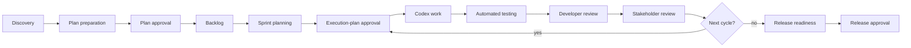
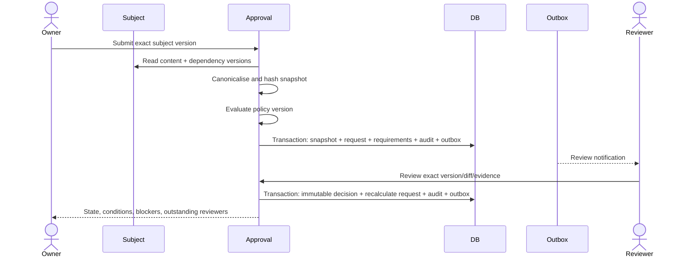
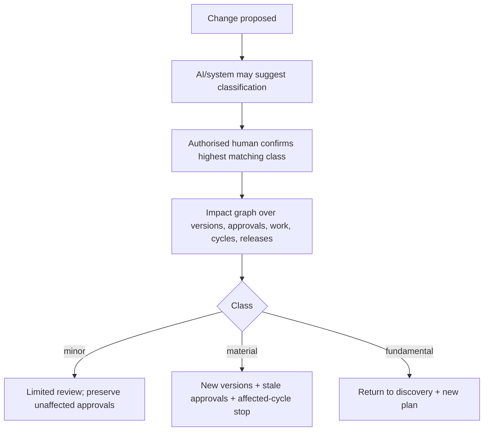
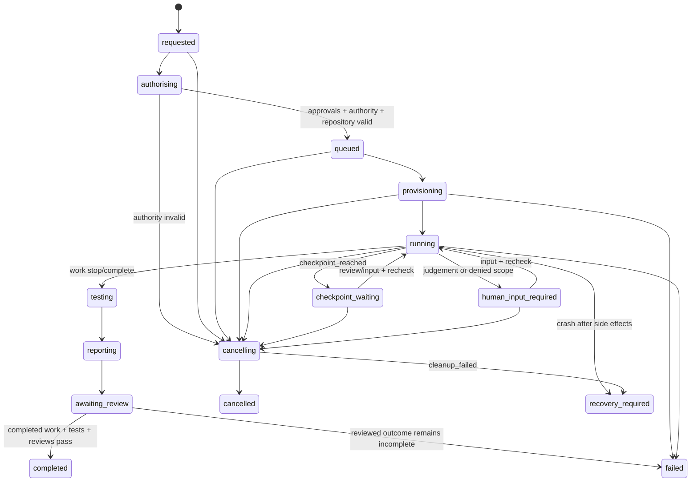

# Workflows and Operational Approvals

Status: Proposed
Canonical state definitions: this document and [Domain Model](02-domain-model.md)

## Design approach

The first product ships a polished Agile workflow using versioned Light, Standard, and High-Assurance presets. The database stores definitions, versions, display states, transitions, and configured policy references. Application code owns security and integrity invariants. There is no arbitrary expression language, workflow scripting, or visual builder in the initial release.

Future Waterfall, hybrid, and organisation templates reuse the same definition/version/instance/transition model rather than becoming separate applications.

## Fixed and configurable behaviour

### Fixed invariants

- Tenant and project authorisation.
- Immutable evidence, artifact versions, approval snapshots, and approval decisions.
- Approvals apply to exact hashes and dependency manifests.
- AI cannot approve, review its own work, or change authority.
- One execution cycle per approved execution-plan version.
- Authority recheck before execution and resumption.
- Runner capability cannot exceed the approved execution plan.
- Completion requires configured tests and human reviews.
- State, audit, and outbox writes are atomic.

### Versioned configuration

- Stage labels and optional non-security states.
- Allowed role/user approval requirements.
- Role aggregation and distinct-principal groups.
- Required sprint, checkpoint, technical, stakeholder, and release reviews.
- Readiness criteria and warning/blocking severity.
- Execution limit defaults within operator maximums.
- Notification routing and escalation times.

## Agile workflow

Light mode can omit separate sprint approval and combine developer/stakeholder project-plan requirements when policy permits. It cannot omit execution-plan approval, authority rechecks, scope enforcement, or required outcome review.

## Project workflow states

Recommended product-facing states:

- `discovery`
- `planning`
- `plan_in_review`
- `ready_for_backlog`
- `delivery`
- `release_in_review`
- `released`
- `on_hold`
- `archived`

These are presentation/workflow states. Artifact, approval, sprint, execution, and release aggregates maintain their own precise state machines.

## Operational approval model

### Definitions

**Project approval** is an authenticated operational decision against an immutable `approval_snapshot`. It proves who acted, their authority at that time, their decision, conditions/comments, and the exact canonical payload/hash.

**High-Assurance project approval** uses the same engine and can require recent MFA/reauthentication, distinct principals, separation of duties, stronger evidence/readiness rules, and additional reviewers. It remains an operational project control, not a Legal electronic signature.

**Legal electronic signature** is a future optional module. No initial workflow waits for it, no initial approval state implies it, and no initial acceptance criterion depends on it.

### Subject snapshot

Before review opens, the application creates one immutable snapshot containing:

- subject kind, stable ID, and exact version ID;
- content and dependency schema versions;
- exact dependency version IDs and hashes;
- canonical payload and SHA-256 content hash;
- policy/readiness references needed to understand review scope.

A snapshot never points to “latest.” If selected content changes, a new snapshot and approval request are required.

### Policy evaluation

An `approval_policy_version` evaluates into immutable `approval_requirements` when the request opens. Requirements may name users, roles, permission predicates, minimum counts, distinct-principal groups, reauthentication windows, and whether one decision can satisfy several eligible requirements.

Defaults:

- Light: role aggregation allowed unless a policy forbids it.
- Standard: distinct people for technical and stakeholder approval where both requirements exist.
- High-Assurance: distinct people and recent MFA/reauthentication; the author cannot satisfy configured independent-review requirements.

A later role change does not rewrite historical decisions. It can invalidate their use for future execution if current authority is a configured prerequisite.

### Decisions and request calculation

Decisions are `approved`, `approved_with_conditions`, `changes_requested`, or `rejected`.

- `approved`: satisfies its requirement.
- `approved_with_conditions`: satisfies only if policy permits and every binding condition is resolved/accepted.
- `changes_requested`: request becomes `changes_requested`; a new version normally creates a replacement request.
- `rejected`: request becomes `rejected` unless the policy explicitly supports reconsideration through a new request.

Request states are `pending`, `approved`, `changes_requested`, `rejected`, `withdrawn`, and `stale`. Staleness never changes the stored decision.

## Approval process

## Approval staleness and invalidation

### Rules

1. A changed subject always creates a new subject version.
2. If the canonical content/dependency hash changes, the old snapshot remains immutable.
3. The impact service determines which approval requests depend on the changed version.
4. Relevant requests become `stale` with a reason and replacement link.
5. Decisions remain queryable as historical facts but cannot satisfy the new request.
6. Minor presentation-only changes may preserve approval only if canonical approvable content is unchanged and policy explicitly treats the field as non-semantic.

### Revocation

Revocation is not a decision or request state. An authorised revoker appends `approval_revocations`; current-validity evaluation immediately fails, affected execution cycles receive cancellation intent, and the original snapshot/request/decisions remain historical. Continuing requires a new approval request, not restoration or mutation of the old decision.

### Concurrency

Opening, deciding, staling, and authorising use expected state/`lock_version`. The decision transaction locks the request and requirement rows, rejects stale snapshots, inserts one immutable decision, recalculates request state, and writes audit/outbox atomically.

## Readiness

Readiness is a deterministic evaluation, not an AI score. Rule results are visible, attributable, and classified as blocking, warning, or informational. Example blockers:

- unanswered required question;
- unresolved evidence contradiction;
- unverified high-impact assumption;
- missing acceptance criterion;
- stale or missing required approval;
- missing repository/test/scope configuration;
- unresolved execution review;
- prohibited-content incident still open.

An optional percentage is the share of applicable rules satisfied; it is never a permission check. AI may explain results or recommend questions but cannot change rule outcomes.

## Change classification

### Minor

All must be true:

- no changed external behaviour or intended user outcome;
- no changed acceptance criterion, scope, security, privacy, permission, data handling, integration, or workflow;
- no changed regulated-data boundary;
- examples include wording, small visual adjustment, internal refactoring, or test improvement.

Minor changes require the limited review configured by policy. Approved plan snapshots remain usable only when their canonical approvable dependency manifest is unaffected.

### Material

Any of:

- new or changed externally visible feature;
- workflow/integration/data-flow change;
- security/privacy/permission implication;
- changed acceptance criterion, delivery scope, repository scope, or important dependency;
- changed unresolved risk or assumption affecting implementation.

Material changes create new affected versions, stale dependent approvals, re-evaluate readiness, and cancel affected queued/running cycles.

### Fundamental

Any of:

- changed project objective, intended user, success definition, or core solution;
- changed business model;
- entry into regulated activity or intentional regulated-health-data storage;
- replacement of the product’s central approach.

Fundamental changes return the project to `discovery`, require a new plan version/approval cycle, and block dependent future execution.

### Classification process

An authorised downgrade from the suggested/highest automatic match requires a written rationale and audit event.

## Sprint approval

Sprint approval is optional by preset/policy, but the sprint must always link exact work-item and requirement/criterion versions. Opening sprint review freezes an immutable sprint-plan snapshot. Changes to committed work, goal, dependencies, or acceptance links stale its approval when configured.

## Execution-plan approval

An execution-plan version cannot enter an approval request without:

- objective and selected work items;
- exact project-plan/artifact versions;
- GitHub repository and approved base commit;
- branch create/select strategy;
- permitted paths, network destinations, tools, systems, and secrets;
- acceptance criteria and required tests;
- checkpoint/stop conditions;
- turn, task, token, cost, and time limits;
- report/review requirements.

One approved execution-plan version may create one cycle. A stopped/failed/completed cycle is never “retried” as a second cycle against the same version. New authorised work requires a new execution-plan version.

## Canonical execution-cycle workflow

The state `awaiting_review` includes successful work, partial work, limit stops, and failed tests. The stop reason and test/report/review data explain outcome. `completed` requires `stop_reason = completed`, required tests passed, complete report evidence, required reviews passed, revoked grants, and destroyed environments. A reviewed test failure, limit stop, scope stop, rejected result, or other incomplete outcome transitions to `failed` with its original exact stop reason; it never appears as completed.

Runner environments have a separate lifecycle: `requested → creating → ready → active → revoking → destroying → destroyed`, with `cleanup_failed → destroying` for idempotent retry or manual recovery. Cycle and environment transitions are correlated but never collapsed into one status.

## Authority-change behaviour

| Event | Before runner starts | While runner is active/suspended |
|---|---|---|
| Required approval revoked or made stale | Before issuance: `authorising → cancelling → cancelled`, no capability. After issuance: `{queued, provisioning} → cancelling`, revoke grant, do not start, clean up. | `→ cancelling`; revoke capability, stop, preserve/report work, request review |
| Required stakeholder leaves or loses authority | Current-use approval invalid; apply the same no-issue or pre-start revocation path | Same cancellation path; historical decision remains |
| GitHub installation/repository permission changes | Reconcile; cancel if approved access is unavailable | Stop new actions; revoke/cancel if access cannot be restored without changing scope |
| Material/fundamental affected change approved | Cancel and require new plan/version | Revoke/cancel and require new execution-plan version |
| Unrelated approved change | No effect; audit impact result | Continue; audit impact result |
| Blocked file/network request | Not applicable | Deny, audit `agent_action_denied`, enter `human_input_required`; never widen automatically |
| Token/cost/turn/task/time limit | Prevent start if invalid/zero budget | Controlled stop, report partial result, `awaiting_review` with exact reason |
| Tests fail | Not applicable | Preserve results, report, request review; never `completed` |
| Human decision requested | Not applicable | `human_input_required`; revoke capability and recheck before issuing a renewed grant to resume |
| Cancellation | `→ cancelling → cancelled` | Revoke immediately, graceful stop, hard kill after 30 seconds, cleanup |
| Runner crash | Retry provision/start before side effects | Preserve workspace/patch, `recovery_required`; no automatic Codex rerun |
| Duplicate execution request | Return existing cycle via unique/idempotency rule | Return existing cycle; no new job/environment/PR |

## Queue, transactions, audit, and outbox

Canonical jobs:

- `execution.authorise`
- `runner.provision`
- `runner.start`
- `execution.run-tests`
- `execution.generate-report`
- `execution.cancel`
- `runner.cleanup`
- `execution.request-review`
- `execution.reconcile`

Job ID: `cycle:{cycle_id}:{stage}:{attempt}`. Cycle command idempotency key: `execution-cycle:{execution_plan_version_id}`.

Every lifecycle transition transaction:

1. locks the aggregate and validates expected state/`lock_version`;
2. rechecks relevant invariant for the transition;
3. writes state and reason;
4. appends a safe audit event;
5. appends a versioned outbox event;
6. commits before external work begins.

External operations use durable intent and reconciliation. Retrying a branch, commit, PR, report upload, notification, or cleanup first checks the recorded intent and external state.

## Review checkpoints

Checkpoint review records exact cycle/report snapshot, reviewer, authority, decision, conditions, and time. Decisions are `continue`, `changes_requested`, `stop`, or `approved_checkpoint`. Continuing the same cycle is allowed only when scope, limits, dependencies, approvals, membership, and repository authority remain valid. Any required material change creates a new execution-plan version and cycle.

## Release approval

A release snapshot includes exact requirement versions, work items, code changes/commits/PRs, tests/results, execution reports/reviews, known limitations, unresolved risks, and rollback/communication notes. Deterministic readiness checks precede operational approval. A release may be recorded as approved/released without the product orchestrating deployment.

## Future methodology support

Waterfall and hybrid templates may add stage/state arrangements and policy presets. They cannot change core evidence/version/approval/execution/release invariants. A future custom workflow builder must validate definitions against those invariants and version every published change.
