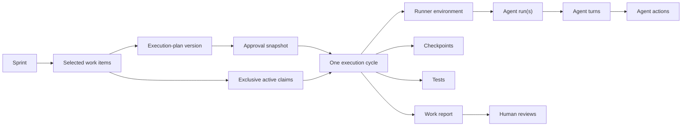
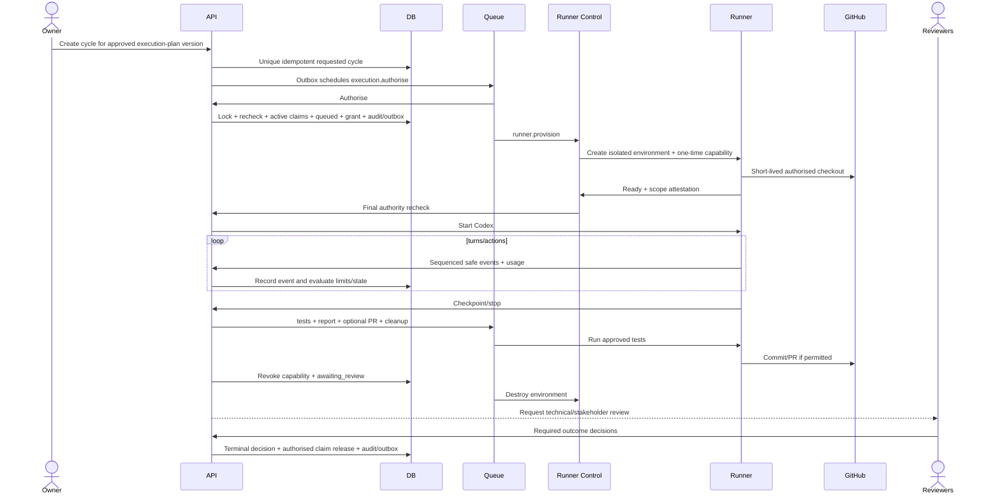

# AI and Codex Architecture

Status: Proposed
Authoritative runner states: [Workflows and Approvals](04-workflows-and-approvals.md)
Authoritative tables: [Data Model](03-data-model.md)

## Principles

1. AI proposes; authorised humans confirm, approve, and release.
2. Human knowledge, imported evidence, AI content, and system output remain visibly distinguishable.
3. Important AI conclusions cite exact evidence where practical.
4. Prompts, schemas, model profiles, evaluations, usage, and accepted outputs are versioned and auditable.
5. General AI assistance and coding-agent execution use separate capability-aware interfaces.
6. A provider abstraction exposes differences rather than reducing every provider to a lowest common denominator.
7. Codex receives only the authority in one approved execution-plan version.
8. Limits and approval checks are enforced outside the model.

## AI use-case matrix

| Use case | Initial mode | Output | Human boundary |
|---|---|---|---|
| Suggested questions | Interactive, optionally queued | Proposed questions + why they matter | Human selects/edits/publishes |
| Follow-up questions | Interactive | Proposed follow-ups tied to response/evidence | Human sends or rejects |
| Requirement extraction | Asynchronous | Structured proposed artifact versions + evidence candidates | Human reviews/corrects |
| Assumption detection | Asynchronous | Proposed assumptions + rationale/evidence gaps | Human confirms status |
| Conflict detection | Asynchronous | Candidate contradictory fragments + explanation | Human resolves/accepts conflict |
| Risk identification | Asynchronous | Proposed risks and response ideas | Human owns/edits |
| Acceptance-criteria generation | Asynchronous | Proposed measurable criteria | Human edits and links |
| Backlog generation | Asynchronous | Proposed epics/stories/tasks and trace links | Human plans sprint |
| Plan summary | Interactive for small plans; queued for large | Clearly labelled summary | Never substitutes for exact review |
| Readiness explanation | Interactive over deterministic results | Advisory explanation | Cannot alter rule outcome |
| Codex execution | Always asynchronous isolated runner | Code/actions/tests/report | Requires prior and subsequent human control |
| Work report generation | Runner stage | Structured report + plain/technical summaries | Reviewers decide outcome |
| Demonstration comparison | Asynchronous synthetic evaluation | Direct-to-Codex baseline and platform-assisted metrics/report | Human-reviewed demo evidence only; never authority |

Interactive calls are bounded, read-only suggestions expected to complete quickly. Work that produces multiple persistent proposals, has retry/cancellation needs, can run longer than a request, or consumes significant budget uses BullMQ. Codex always runs outside the API/worker process.

## Provider interfaces

### `GenerationProvider`

Capability-aware operations:

- structured response generation from a versioned schema;
- streaming where the selected model supports it;
- background execution and cancellation;
- tool/function calling for explicitly registered read-only or proposal tools;
- provider response retrieval/webhook reconciliation;
- usage/token/cost extraction;
- safety/refusal/error classification.

The provider returns provider-neutral domain envelopes plus provider-specific metadata under a namespaced field. Unsupported capabilities are declared during profile validation, not discovered mid-job.

### `CodingAgentProvider`

Initial implementation wraps the server-side [Codex SDK](https://learn.chatgpt.com/docs/codex-sdk) inside `apps/runner`. It supports starting/resuming a coding thread, sandbox configuration, event capture, cancellation, and structured final reporting. It never owns project approval or capability issuance.

### Other ports

- `RunnerProvisioner`: create/inspect/destroy isolated environments.
- `RepositoryAdapter`: authorised checkout/branch/commit/PR/check operations.
- `SecretBroker`: one-cycle secret materialisation and revocation.
- `EventSink`: authenticated sequenced safe activity ingestion.
- `UsageLedger`: atomic limit evaluation and cost attribution.

## Prompt and model governance

- Keep production prompts in version-controlled typed modules, following current OpenAI guidance to treat prompts as application code rather than depend on reusable provider prompt objects: [Prompting guide](https://developers.openai.com/api/docs/guides/prompting).
- Each request records use-case key, prompt code version/Git revision, input schema/hash, output schema, model profile, safety configuration, and organisation budget context.
- Use Zod schemas compiled to supported JSON Schema and the Responses API’s [Structured Outputs](https://developers.openai.com/api/docs/guides/structured-outputs).
- Pin an evaluated model profile for each use case. Model aliases may be trialled behind evaluation gates; a model change is a reviewed configuration release.
- Never store hidden chain-of-thought. Store rendered instructions/input manifests and provider-returned user-visible output only under retention policy.
- Origin is always one of `human_authored`, `ai_generated`, `ai_generated_human_edited`, `imported`, or `system_generated`. Accepted AI proposals use `ai_generated` or `ai_generated_human_edited` and retain a link to the originating job/output.
- Refusals, schema failures, missing evidence, and provider failure remain explicit outcomes; do not coerce them into plausible content.

## AI input and evidence handling

1. Resolve authorised source/version IDs in application code.
2. Apply tenant, project, sensitivity, and prohibited-content checks before rendering.
3. Construct the smallest necessary evidence bundle with stable source identifiers.
4. Redact configured secrets and direct identifiers.
5. Send only the selected bundle to the provider.
6. Validate structured output and every cited source identifier.
7. Store output as a proposal; invalid citations are flagged and cannot become confirmed evidence links.

The system does not treat a model citation as proof. The source fragment remains the evidence; the link is reviewable metadata.

## Healthcare-data filtering

All initial projects have `general_business` classification. Input screens and uploads warn against patient names/contact details, identifiable treatment histories, clinical records, patient-linked medical images, and identifiable health information.

Before provider forwarding:

- deterministic patterns and a bounded classifier can flag likely identifiers/clinical records;
- suspicious file/text is withheld and a restricted incident/quarantine record is created;
- users receive safe guidance to rewrite the input as a generic, non-identifiable scenario;
- audit/log/notification payloads contain only safe incident identifiers and actions;
- detection is explicitly a safety aid, not a guarantee or healthcare-compliance control.

## Direct-to-Codex baseline comparison

The canonical demonstration runs a controlled evaluation with two arms against the same versioned synthetic `general_business` scenario and deterministic fixture repository:

1. **Direct-to-Codex baseline:** receives only the original project idea, without discovery questions, stakeholder answers, evidence, structured requirements, acceptance criteria, plan approval, or production runner authority. Its output is inspected for unsupported assumptions, missing requirements, domain questions not asked, missing acceptance criteria, and corrections requested after stakeholder review.
2. **Platform-assisted:** uses the exact discovery evidence, reviewed artifacts, approved plan, backlog/sprint, approved execution plan, restricted cycle, tests, and reviews. Its result records requirements discovered, assumptions prevented, acceptance-criterion coverage, corrections required, stakeholder-confidence evidence, and requirement-to-code-to-test traceability.

`demonstration_comparisons` owns the synthetic scenario/fixture and exact input manifests. Each final `demonstration_comparison_results` version is immutable, hashed, and superseded rather than edited. `demo.generate-comparison` produces the structured report and plain-language results projection using deterministic fixtures by default; an optional evaluated live-provider run is labelled separately. The baseline is restricted to the dedicated demo tenant/repository and is not an endpoint that bypasses execution-plan approval or capability issuance.

## Job design

### General AI jobs

`ai_jobs.idempotency_key` is derived from organisation, use case, prompt version, model profile, and canonical input hash. A completed equivalent job may be reused only when freshness policy permits. Jobs use bounded exponential backoff with jitter for transient provider/rate errors, no retry for invalid schema input/safety refusal, and explicit cancellation state. The demo comparison job uses `demo-comparison:{comparison_id}:{method_version}:{input_hash}` and writes a new immutable result only after both manifests validate.

Long Responses API work can use provider background execution, status retrieval, cancellation, and verified webhook events where appropriate; see [Background mode](https://developers.openai.com/api/docs/guides/background) and [Webhooks](https://developers.openai.com/api/docs/guides/webhooks). BullMQ remains the application’s durable coordinator and reconciles provider state after missed/duplicate callbacks.

### Usage and budgets

Every provider usage event is deduplicated by provider request/event ID. Token categories, currency, minor-unit cost, use case, project, and organisation are recorded. The application applies organisation/project/use-case budget checks before dispatch and after each event. Estimated cost is visibly distinguished from final provider usage.

## Codex execution relationships



One cycle may contain multiple Codex turns and, after a recoverable process restart, more than one `agent_run`. It cannot contain work outside the approved version. Resumption after a checkpoint stays in the same cycle only if scope/limits/authority remain valid.

The lifecycle persists through the canonical records `execution_plans`, `execution_plan_versions`, `execution_cycles`, `execution_cycle_work_items`, `execution_work_item_claims`, `runner_capability_grants`, `runner_environments`, `agent_runs`, `agent_turns`, `agent_actions`, `execution_checkpoints`, `execution_usage_events`, `execution_test_runs`, `execution_work_reports`, `execution_reviews`, `code_changes`, and `changed_files`. No runtime-only state may substitute for these authoritative records; detailed constraints are in [03-data-model.md](./03-data-model.md).

The canonical cycle path is `requested → authorising → queued → provisioning → running → checkpoint_waiting | human_input_required | testing → reporting → awaiting_review → completed`, with `cancelling → cancelled`, `failed`, and `recovery_required` as exceptional outcomes. The separate environment path is `requested → creating → ready → active → revoking → destroying → destroyed`, with `cleanup_failed` as its exception.

## Exact runner lifecycle

### 1. Execution plan approved

An execution-plan approval request reaches `approved`. Its immutable snapshot includes objective, exact plan/artifact/work versions, repository, base commit, branch strategy, path/network/tool/secret policies, limits, tests, stop conditions, and review requirements.

### 2. Final authority and approval recheck

`execution.authorise` performs `requested → authorising` inside one transaction while locking the cycle, plan version, approval request and immutable snapshot, policy result, any `approval_revocations`, required memberships/authorities, repository mapping, selected work items, and idempotency record. It inserts the complete `execution_work_item_claims` set before queuing. The partial unique active-claim index turns a race into an atomic conflict; rollback leaves the cycle `requested` and removes the entire attempted claim set. A separate idempotent transaction records a safe denial. It rejects a `stale`/withdrawn request or use of a snapshot whose corresponding request is not current authority, consumed plan version, unresolved conditions, invalid membership, open prohibited-content blocker, inaccessible repository, or any already-claimed work item.

### 3. Short-lived runner capability issued

On success, the same transaction creates the logical `runner_environments` row in `requested`, records a hashed opaque grant bound to that row and its exact scope hash/expiry, transitions `authorising → queued`, and appends claim-acquired, cycle, audit, and outbox records. After commit, the raw token is placed in a sealed one-use broker handoff; it is delivered only inside the attested created environment, never returned to the application UI, logged, or stored in plaintext, and is renewable only after another authority recheck.

### 4. Isolated runner environment created

`runner.provision` creates a rootless/least-privilege container or stronger configured sandbox. `runner_environments` follows `requested → creating → ready`; provisioning identity and policy hash are recorded.

### 5. Approved repository and commit checked out

The runner obtains a short-lived GitHub installation token, fetches the mapped repository, verifies repository identity and exact commit hash, and checks out without executing repository hooks or startup code.

### 6. Approved branch created or selected

The runner applies the immutable branch strategy. Creation and selection are reconciled against a durable intent. Existing unexpected branch state stops provisioning rather than overwriting it.

### 7. Permitted workspace paths mounted

Only the checkout and explicitly authorised writable roots are mounted. Disallowed workspace paths are absent or read-only. Path policy resolves real paths/symlinks before access decisions.

### 8. Network policy applied

Default-deny egress is configured. DNS/IP/host/port rules derive from the approved policy and protect against redirection/SSRF. GitHub/OpenAI/package endpoints are allowed only when explicitly required.

### 9. Secrets supplied only when authorised

The secret broker materialises minimum scoped credentials into tmpfs/file descriptors, not command lines or general logs. Each secret has a purpose, recipient process, expiry, and revocation handle.

### 10. Codex process started

After provisioning, the control plane rechecks authority again. It transitions cycle `provisioning → running`, environment `ready → active`, records an `agent_run`, and starts the Codex SDK with the approved prompt, workspace, sandbox, and tool set.

### 11. Safe activity streamed

Sequenced authenticated events represent turns, commands, file operations, tool calls, denied actions, checkpoints, tests, messages, and usage. Redaction occurs before ingestion. The API projects them to SSE; reconnect uses last event ID.

### 12. Limits monitored

Turn, task, input/output token, cost, wall-clock time, and scope usage update atomic ledgers. Soft thresholds warn; hard thresholds prevent the next action/turn and choose a stop reason.

### 13. Stop conditions continuously evaluated

The external controller evaluates approvals, membership, repository access, change impact, capability expiry/revocation, limits, checkpoint conditions, policy denials, cancellation, provider state, and runner health. Codex cannot override the result.

### 14. Required tests run

On controlled work stop/completion, `execution.run-tests` transitions to `testing`. Commands come from the immutable plan, run in the authorised environment, and produce structured results. Failed tests are evidence and prevent completion but do not erase changes.

### 15. Structured work report generated

`execution.generate-report` transitions `testing → reporting`. It records objective, work completed/not completed, files/commits, tests, denied actions, usage, limitations, risks, stop reason, and next decisions. It has plain-language and technical views.

### 16. Changes committed or preserved

Where authorised, changes are committed with trace metadata. Otherwise an encrypted patch/workspace artifact is preserved under retention policy. Commit intent and result are reconciled; no destructive reset is used to hide partial work.

### 17. Pull request created where permitted

The GitHub adapter pushes/creates a PR only if the execution plan permits it. A durable `code_changes` intent and marker prevent duplicate branches/PRs. The PR links the cycle/report and is not represented as completion.

### 18. Runner capability revoked

The grant is revoked before cleanup or human wait. Renewal stops. GitHub/provider/secret credentials are revoked/expired, and revocation is audited.

### 19. Runner environment destroyed

`runner.cleanup` drives `active|ready → revoking → destroying → destroyed`. Cleanup is idempotent and retries. Secret revocation precedes filesystem/network destruction. `cleanup_failed` places the cycle in `recovery_required` and alerts an operator.

### 20. Human review requested

The cycle transitions `reporting → awaiting_review`; `execution.request-review` notifies configured technical and stakeholder reviewers. Active work-item claims remain held. `completed` additionally requires `stop_reason = completed`, required tests passed, complete report evidence, revoked grants, destroyed environments, and required reviews passed. The authorised completion transaction records `required_review_completed`, releases the claims, and appends audit/outbox atomically. A reviewed incomplete or failed result transitions to `failed` with its exact stop reason, but its claims remain until an authorised failure-recovery decision explicitly releases them.

## Runner sequence



## Continuous limit and policy enforcement

- Filesystem operations resolve normalised real paths and symlinks against allowed roots before execution.
- Network operations pass through enforced egress controls, not prompt instructions alone.
- Tool availability is an allowlist in the runner configuration.
- Secret broker validates grant, cycle state, tool identity, purpose, and expiry for every retrieval.
- Usage ledger atomically increments and returns `continue`, `warn`, or `stop`.
- The controller subscribes to approval/membership/change/repository revocation events and also polls/reconciles in case events are missed.
- Capability expiry is short; renewal is online and fails closed.
- The controller verifies that every selected work item retains an active claim for the current cycle before starting or resuming. It never creates or releases claims from runner events.

## Failure and recovery matrix

| Condition | State/action | Retry | Evidence/recovery |
|---|---|---|---|
| Approval revoked before capability issuance | `authorising → cancelling → cancelled`; no raw capability | No | Immutable history + cancellation audit/outbox |
| Approval revoked after issuance but before Codex starts | `{queued, provisioning} → cancelling → cancelled`; revoke capability/secrets, do not start, clean up | Cleanup only | Grant/environment events and cancellation audit/outbox |
| Approval revoked during execution | `→ cancelling`, capability/secret revoke, stop | Cleanup only | Partial report/review; new plan version if continuing |
| Required stakeholder leaves | Future authority invalid; same cancellation policy | No automatic substitution | Policy owner appoints reviewer and opens new approval |
| Repository permission changes | Stop new actions and reconcile | Bounded transient retry | Restore exact access or cancel/new plan |
| Affected material change approved | Revoke/cancel | No | Impact graph + new plan/execution-plan version |
| Selected work item already claimed | Roll back complete authorisation transaction to `requested`; no capability/environment/partial claims | Retry same cycle only after authorised release | Safe conflict plus separate idempotent denial audit/outbox; existing claimant unchanged |
| Blocked file | Deny, `agent_action_denied`, `human_input_required` | No | Reviewer narrows task or creates new plan; never auto-widen |
| Unauthorised network | Enforced deny, same stop path | No | Safe target metadata, security review |
| Token/cost/turn/task/time limit | Controlled stop → tests/report/`awaiting_review`; after review, `failed` | No | Exact counter/threshold and partial work |
| Tests fail | Report and `awaiting_review`; after review, `failed`, never `completed` | Only a new authorised execution-plan version and cycle | Test results, logs under retention, reviewer decision |
| Codex asks for judgement | `human_input_required`, capability revoked | Resume only with a renewed grant after recorded input + recheck | Checkpoint record |
| Crash before side effects | Mark failed attempt; retry provision/start up to 3 | Exponential backoff+jitter | Attempt/environment events |
| Crash after side effects | `recovery_required` | Never auto-rerun Codex | Preserve patch/workspace; operator reconcile |
| Cancellation requested | `cancelling`, revoke, graceful stop for `runner_graceful_shutdown_seconds` (default 30, bounds 5–120) | Cleanup retry | Cancellation actor/reason, effective grace and final report if possible; release claims only after safe cancellation |
| Graceful cancellation times out | Hard-kill and cleanup | Cleanup retry | `user_cancelled`; operator alert if cleanup fails |
| Duplicate cycle request | Return unique existing cycle | Not applicable | Idempotency record |
| Duplicate branch/commit/PR job | Reconcile durable intent/external marker | Safe bounded retry | Existing `code_changes` result reused |
| Cleanup failure | Secrets revoked; environment `cleanup_failed`, cycle `recovery_required`; retain claims | Backoff then manual | Operator alert and cleanup runbook; no implicit claim release |
| Failed/recovery-required outcome | Retain claims after report/review | No automatic release | Authorised recovery command may preserve/abandon work and release with `authorised_failure_recovery` |

## Queue and idempotency contract

Canonical jobs are `execution.authorise`, `runner.provision`, `runner.start`, `execution.run-tests`, `execution.generate-report`, `execution.cancel`, `runner.cleanup`, `execution.request-review`, and `execution.reconcile`.

- Cycle command: `execution-cycle:{execution_plan_version_id}`.
- Job ID: `cycle:{cycle_id}:{stage}:{attempt}`.
- Activity event: unique environment/run sequence.
- Usage: unique provider/event ID.
- GitHub side effect: unique cycle/repository/kind intent plus external marker.
- Cleanup: unique runner environment; repeated destroy returns success when already absent.

BullMQ exhaustion moves the job to a dead-letter/recovery workflow, not silent failure. `execution.reconcile` compares database intent, provider/GitHub state, environment inventory, capability expiry, and missing terminal events.

## Database and external transaction boundaries

Every state transition uses expected state and `lock_version`, appends audit/outbox in the same transaction, and commits before an external call. Usage increments and hard-limit decisions are atomic. Provider/GitHub/runner callbacks enter a deduplicated inbox and are applied in a new transaction.

Claim acquisition is part of `execution.authorise`: all selected rows insert or none do. Claim release is a separate explicit domain command in the terminal review, safe-cancellation, authorised-recovery, or authorised-change transaction. Failure recovery proves capability/secret revocation and environment containment first; authorised change removal safely stops/contains the affected cycle first. If an acquisition uniqueness conflict rolls back, a separate idempotent transaction records the safe denial/audit outcome; it cannot issue a capability or mutate the existing claim.

No database transaction remains open while awaiting OpenAI, GitHub, object storage, container provisioning, command execution, tests, or human review.

## Event and audit model

Safe event categories:

- `execution_cycle.*`
- `execution_work_item_claim.acquired|conflict|released`
- `runner_environment.*`
- `runner_capability.issued|renewed|revoked|expired`
- `agent_run.*`, `agent_turn.*`, `agent_action.*`, `agent_action_denied`
- `execution_limit.warning|reached`
- `execution_checkpoint.*`
- `execution_test_run.*`
- `execution_work_report.created`
- `code_change.*`, `pull_request.*`
- `execution_review.*`
- `runner_cleanup.*`

Audit stores identity, authority, aggregate/version, safe target summary, policy/result, hashes, timestamps, and correlation/causation. Raw secret values, suspected prohibited content, hidden reasoning, and unredacted command output are excluded.

## Cancellation and manual recovery

Cancellation is an idempotent command. It immediately revokes the grant, secret leases, and renewal before signalling the process. The supervisor waits the validated `runner_graceful_shutdown_seconds` value—default `30`, allowed `5` through `120`—then hard-kills the process. Cleanup then destroys compute/network/workspace. A failed cleanup creates an operator-visible `recovery_required` case and retains every work-item claim.

Cleanup guarantees are fail-closed:

- capability and secret revocation is independent of runner responsiveness and is always attempted first;
- `runner.cleanup` targets one immutable environment ID, is idempotent, and treats an already-absent environment as successful after reconciliation;
- `completed` and `cancelled` require no valid grant/secret lease and every created environment to be `destroyed`; a pre-provision cancellation may have no environment. Otherwise the cycle remains `cancelling` or `recovery_required`;
- `cleanup_failed` is never silently terminal: bounded backoff, operator alert, and periodic `execution.reconcile` continue until the exact environment is destroyed or an operator records an exceptional containment decision;
- workspace/patch evidence needed for authorised review is encrypted/preserved before destruction, but preservation never keeps an execution capability valid.
- claims release only after safe cancellation reaches its authorised terminal transaction; cleanup failure or `recovery_required` keeps them active.

The manual runbook must let an operator:

1. inspect safe cycle/environment/grant state;
2. verify no valid capability or secret lease remains;
3. snapshot/preserve an authorised patch if required;
4. terminate the runtime by immutable environment ID;
5. remove network/volume resources;
6. reconcile GitHub branch/commit/PR intent;
7. record cleanup evidence and move `cleanup_failed → destroying → destroyed`;
8. return the cycle to `awaiting_review`, `cancelled`, or keep `recovery_required` with rationale;
9. where failure recovery is explicitly authorised, record the immutable recovery decision and release exact claims with `authorised_failure_recovery` in the same state/audit/outbox transaction.

Manual recovery cannot mark work completed or issue new authority.

The self-hosted distribution must expose the non-interactive administrative command contract below (the binary/package name may be bound during Slice 1, but flags and safety semantics are stable):

```text
runner-recovery inspect --cycle-id <uuid> --environment-id <immutable-provider-id>
runner-recovery reconcile --cycle-id <uuid> --environment-id <immutable-provider-id> --dry-run
runner-recovery cleanup --cycle-id <uuid> --environment-id <immutable-provider-id> --expected-cycle-state recovery_required --confirm-environment-id <immutable-provider-id>
```

`inspect` is read-only and prints redacted database/provider/GitHub intent differences. `reconcile --dry-run` proposes state/evidence changes; an operator must then rerun it with an explicit generated confirmation token. `cleanup` refuses broad/globbed targets, verifies the exact cycle/environment relationship and revoked grants/secrets, destroys only that immutable environment, and writes cleanup evidence, audit and outbox records. Commands are idempotent, return success when the exact environment is already absent, and never delete repository branches, commits or pull requests.

## Human review boundaries

- Project artifacts: AI output remains proposed until human edit/confirmation.
- Plans, sprints where configured, execution plans, cycle continuation, execution outcome, and releases require operational human decisions.
- The domain expert reviews relevant product behaviour, not raw technical logs.
- The technical reviewer sees the full safe action/file/test evidence.
- AI may summarise evidence but its summary is labelled and never counts as review.

## Retention and sensitive outputs

- Project-history records: accepted artifacts, structured action metadata, usage, final reports, reviews, and hashes.
- Raw rendered AI prompts/outputs: encrypted, default 90 days.
- Raw runner command/log objects: encrypted, default 30 days.
- Provider IDs and encrypted thread handles: retained only as required for reconciliation/audit.
- Organisation policy can shorten/extend retention within operator/legal limits.
- Prohibited content follows quarantine/purge rules and is never copied into AI datasets or evaluation fixtures.

## Evaluation strategy

Each use case has representative fixtures and assertions for schema validity, source-ID validity, omission, unsupported certainty, origin, conflict handling, refusal, cost/latency, and human edit burden. Prompt/model changes do not ship when they regress mandatory assertions. Codex runner evaluation additionally measures scope denials, stopping accuracy, test/report completeness, active-claim races/retention, and duplicate-side-effect prevention.

The demonstration comparison uses a versioned scoring method and deterministic expected fixtures. It reports both raw counts and attributable examples for unsupported assumptions, missing questions/requirements/criteria, corrections, coverage, confidence, and traceability; it never manufactures a favourable platform score. `pnpm docs:validate` verifies that all AI/runner table, state, enum, requirement, backlog, and demo references used here match the canonical planning sources.
