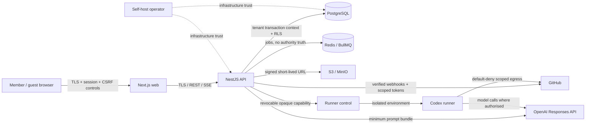

# Security and Privacy

Status: Proposed security architecture
Initial data classification: `general_business`

## Security objectives

- Preserve strict organisation and project confidentiality/integrity.
- Ensure approvals and releases remain bound to exact immutable content.
- Prevent Codex, users, guests, integrations, and operators from exceeding granted authority.
- Keep secrets, raw AI data, repository contents, and attachments appropriately isolated and retained.
- Provide sufficient evidence to investigate human, AI, integration, and runner activity.
- Avoid intentionally collecting patient-identifiable health information in the initial product.

## Assets

- Organisation/project knowledge, evidence, requirements, designs, and attachments.
- Membership, roles, policies, invitations, Better Auth database sessions, passkey/TOTP authenticators, and internal application principals.
- Immutable approval snapshots/decisions and readiness results.
- GitHub installations, repository access, branches, code changes, and PR/test evidence.
- AI prompts/outputs, model profiles, usage/cost, and provider credentials.
- Runner capabilities, exclusive active work-item claims, workspaces, secrets, actions, reports, and preserved patches.
- Release evidence, audit events, inbox/outbox records, encryption keys, and backups.
- Availability and integrity of the self-hosted platform.

## Actors

- Authenticated member acting legitimately or maliciously.
- Project-scoped guest.
- Organisation/project administrator.
- Self-host operator with infrastructure access.
- AI model acting as an untrusted proposal generator.
- Codex process operating inside a constrained runner.
- GitHub/OpenAI/SMTP/object-store integrations and webhook senders.
- External attacker without an account.
- Compromised account, browser, repository, dependency, integration, runner, or provider.
- Malicious tenant attempting lateral access in a future managed deployment.

## Trust boundaries

The runner boundary is hostile-code-sensitive: checked-out repositories, build scripts, dependencies, commands, and model-proposed actions are treated as untrusted.

## Primary threat classes and mitigations

| Threat | Examples | Major controls |
|---|---|---|
| Broken tenant isolation | IDOR, wrong tenant context, cross-tenant FK | `organisation_id`, composite FKs, deny RLS, permission engine, application-role tests |
| Broken project/guest authorisation | Guest accesses settings/evidence not assigned | Explicit project grants, filtered navigation, object/stage checks, negative tests |
| Session/invitation takeover | Stolen link, fixation, replay | Hashed single-use tokens, short expiry, secure cookies, rotation, revocation, rate limits |
| Approval tampering/race | Review mutable content or use a decision from a `stale` request | Canonical immutable snapshot/hash, row locks, optimistic concurrency, authority rechecks |
| Injection/XSS/CSRF/SSRF | Unsafe Markdown, URL fetch, webhook/file content | Zod validation, parameterised SQL, sanitisation/CSP, CSRF/origin checks, URL/egress allowlists |
| Secret disclosure | Logs/prompts/command line/object metadata | Envelope encryption, secret broker, redaction, tmpfs/file descriptors, least privilege, rotation |
| Malicious upload | Malware, polyglot, active content, patient data | Type/size/hash checks, private bucket, forced download, scan/quarantine hooks, prohibited-content incident |
| Webhook replay/spoofing | Fake GitHub/OpenAI event | Raw-body signature verification, timestamp/secret policy, delivery unique key, inbox/reconciliation |
| AI prompt injection/data leakage | Evidence instructs model to exfiltrate | Treat content as data, minimal source bundle, tool allowlists, no tenant-wide retrieval, output validation |
| Runner escape/scope breach | Symlink path escape, network exfiltration, hostile build | Rootless isolated runtime, real-path enforcement, read-only mounts, default-deny egress, capability/secret checks |
| Duplicate/non-idempotent work | Repeated cycle, PR, email, cleanup | Unique constraints, idempotency records, durable intent, inbox/outbox, reconciliation |
| Overlapping execution | Two plan versions modify the same work item concurrently | Atomic `execution_work_item_claims`, partial unique active-claim index, claim retention through review/recovery |
| Data loss/operator failure | Bad migration, backup unusable | Reviewed migrations, expand/contract, encrypted backups, restore tests, health/metrics/runbooks |

## Severity calibration

- **Critical:** cross-tenant bulk disclosure; runner escape to host/other tenants; arbitrary capability issuance; approval bypass that starts broad Codex work; encryption-key compromise with accessible data.
- **High:** project guest privilege escalation; a `stale` approval request is accepted as authority for scoped execution; GitHub token theft; persistent stored XSS; secret disclosure; backup restore bypassing tenant access.
- **Medium:** limited same-project information exposure; non-destructive webhook replay; audit gaps without authority bypass; denial of service within bounded tenant quotas.
- **Low:** non-sensitive metadata disclosure, safe UI inconsistency, or missing hardening that cannot cross a trust boundary.

Severity depends on reachability and deployment. A container escape is particularly serious in a future managed multi-tenant runner. Initial self-host operators already control the host, but project members and repository code do not.

## Authentication and session security

- Better Auth `1.6.23` is the selected self-hosted authentication adapter; all Better Auth core/plugin packages use exactly that patch. It is mounted directly on the Fastify boundary using its Drizzle/PostgreSQL integration. No community NestJS guard or Better Auth organisation plugin is in the trust/authorisation path.
- Sessions are database-backed and cookies are secure, `HttpOnly`, and SameSite. Better Auth cookie caching is disabled so revoke-one/revoke-all, account disablement, and assurance changes take effect on the next authenticated request rather than waiting for a cached session payload.
- Magic-link sign-in is the initial passwordless path and configures `storeToken: 'hashed'`. Magic/invitation/verification tokens are high-entropy, single-use, expiring, rate-limited, and atomically consumed using secure verifiers.
- Passkey and TOTP use first-party plugins, but passwordless sign-in is not assumed to invoke a TOTP challenge. A High-Assurance command instead consumes an app-owned, one-use `reauthentication_grant`, bound to its action and exact subject/snapshot hash, issued after fresh passkey user verification, and expiring within 15 minutes.
- Better Auth `updateAge` is expiry renewal, not token rotation or step-up. At authentication recovery, privilege boundary, or other configured security transition, revoke the old session and require a fresh authenticated session; fixation tests prove the pre-boundary identifier cannot retain authority.
- Better Auth’s documented database session lookup token has no documented hashing option. It is a narrow accepted exception: restrict table/column access, encrypt database volumes/backups, redact telemetry/exports/support bundles, prevent browser/API disclosure, rotate the Better Auth secret under runbook, and cover it with secret-scanning/exfiltration tests. Do not generalise this exception to invitations, magic links, reauthentication grants, or runner capabilities.
- Verified Better Auth user/session/assurance data is converted to an internal application principal. The permission service, project roles, approval eligibility, and PostgreSQL RLS remain application-owned and do not trust provider roles.
- Session inventory and revoke-one/revoke-all are available to users/admins under policy.
- Email address changes, authenticator changes, recovery, and role escalation create high-signal audit/security notifications.
- No browser token is stored in local storage.
- Future OIDC, SAML, and SCIM support implements the same enterprise identity adapter/principal contract without changing application authorisation or RLS.

## Authorisation model

The permission service evaluates actor, organisation membership, project membership, role/grants, project mode, action, resource, workflow stage, approval policy, and object sensitivity. Controllers declare an action; application services enforce it again before state change.

The database never infers business authority solely from RLS. Conversely, passing application authorisation does not bypass RLS.

Guests:

- are project-scoped and deny-by-default;
- cannot enumerate organisation members/projects/settings;
- can access only assigned questions, shared artifact/review context, requested approvals, and relevant plain-language reports;
- cannot administer workflow/integrations, issue runner authority, or view secret/raw technical data;
- lose all access immediately on revocation/expiry, even if a browser route remains open.

## Tenant isolation and RLS

- Every tenant row carries immutable `organisation_id`.
- Tenant relationships use composite `(organisation_id, id)` keys.
- Transactions set validated `SET LOCAL` tenant/actor context; missing context returns no tenant rows.
- API and worker run as non-owner roles without `BYPASSRLS`.
- Background jobs contain opaque IDs, then rehydrate tenant and actor authority; queue data is not trusted.
- Object keys include random identifiers, not customer names; signed URLs are short-lived and permission-checked at issue time.
- Caches include tenant in every key and never cache authorisation responses across actors.
- Exports, search, notifications, analytics, and admin tools receive the same tenant isolation tests as CRUD endpoints.

## Approval security

- Canonical immutable snapshot content is displayed and decision controls bind to snapshot ID/hash.
- The decision transaction locks request/requirement, rejects a request in `stale` state or a snapshot that is no longer usable as current authority, records reviewer authority/reauthentication context, recalculates state, and writes audit/outbox atomically. The snapshot and prior decisions are never marked or mutated as stale.
- High-Assurance policy can require the exact unexpired action/snapshot-bound reauthentication grant, distinct principals, author/reviewer separation, or multiple roles.
- Historical decisions remain immutable if the reviewer later leaves. Current-use validity is re-evaluated before execution/release.
- AI/system/integration/operator actors are structurally ineligible to approve.
- The Legal electronic signature module is future-only. UI/documentation must not call Project approval or High-Assurance project approval legally binding.

## Runner and repository security

### Capability

- Opaque high-entropy token; only hash/JTI/scope hash stored.
- Short expiry and online renewal after authority recheck.
- Scope binds organisation, cycle, repository/commit/branch, path/network/tool/secret policy, limits, and runner environment identity.
- Immediate revocation on cancellation, authority loss, relevant material change, repository loss, or cleanup.

### Active work-item claims

- Authorisation locks selected work items and atomically inserts `execution_work_item_claims`; the partial unique `(organisation_id, work_item_id) WHERE released_at IS NULL` index is the final race control.
- A conflict issues no capability and leaves no partial claim set. The failure is recorded safely without exposing another tenant or unrelated project details.
- Claims persist through checkpoints, human input, testing, reporting, required review, and `recovery_required`; neither the runner nor cleanup may release them.
- Only required-review completion, safe cancellation, an authorised failure-recovery decision after capability/environment containment, or authorised change removal after the affected cycle is safely stopped/contained releases a claim, with audit/outbox in the same transaction.
- Repository-path overlap detection may produce a warning, but it is not a substitute for first-release work-item claims.

### Isolation

- Dedicated process/runtime; never execute repository code in API/worker containers.
- Run rootless/non-privileged, drop capabilities, read-only base image, controlled seccomp/AppArmor/Windows equivalent, resource quotas, and no host socket.
- Mount only the approved checkout and explicit writable roots. Resolve symlinks/real paths before policy decisions.
- Default-deny network egress with protected DNS/redirect resolution.
- Treat package installation and tests as untrusted code execution under the same sandbox.
- Cancellation revokes capabilities and secrets immediately, then gives the process the validated `runner_graceful_shutdown_seconds` interval (default `30`, range `5`–`120`) before hard termination; configuration cannot extend authority.
- Do not offer a hostile multi-tenant managed runner until stronger isolation (for example microVM-class separation), independent review, and incident containment are complete.

### GitHub

- GitHub App with minimum permissions; installation/repository mapping is explicit.
- Installation tokens are short-lived and fetched just in time.
- Branch/commit/PR operations require execution-plan permission and durable intent.
- Webhooks use raw-body verification, delivery dedupe, installation/repository mapping, and periodic reconciliation.
- Repository permission/installation changes revoke future runner authority.

## Secret management

- Self-host instance master key comes from operator secret management, not the database/image.
- Per-secret data-encryption keys use authenticated encryption (AES-256-GCM or equivalent) and store key version/nonces/tags.
- Organisation OpenAI overrides, GitHub App private key, SMTP credentials, storage credentials, and runner secrets have explicit purpose and rotation.
- Runner secret leases are minimum scope, time-limited, materialised to tmpfs/file descriptors, and revoked before environment destruction.
- Logs, exception telemetry, audit payloads, SSE events, AI prompts, test fixtures, exports, and support bundles apply central redaction.

## Browser/API security

- TLS in production; HSTS at the reverse proxy.
- Strict CSP, frame restrictions, MIME sniffing protection, referrer and permissions policies.
- Sanitised CommonMark/GFM subset; raw HTML disabled by default; outbound links safe and clearly external.
- Zod validation at every external boundary; parameterised Drizzle/SQL; no dynamic identifiers from user input.
- Secure-cookie requests use SameSite plus CSRF tokens/origin checks for state-changing operations as required by topology.
- Rate limits are actor/IP/tenant-aware with safe error messages and no account enumeration.
- Errors use stable code/correlation ID and exclude stack, secret, existence, and cross-tenant details.

## File security

1. Create upload intent after permission and quota check.
2. Upload to a private quarantine prefix with size/type/checksum constraints.
3. Validate magic bytes, extension/type consistency, archive limits, image metadata policy, and malware-scan adapter.
4. Run prohibited-content warning/detection where applicable.
5. Promote to available only when checks pass; otherwise quarantine/reject.
6. Issue short-lived signed GET URLs after each access check; force safe content disposition for active formats.
7. Audit metadata and access, not sensitive content.

## AI data security

- Select the minimum authorised evidence fragments; never pass a tenant/project corpus by convenience.
- Treat source text as untrusted data and delimit it from instructions.
- No tool capable of approval, membership, policy, secret, capability, release, or destructive external action is available to general AI assistance.
- Validate schemas, source IDs, tenant ownership, and origin before storing proposals.
- Record provider/model/prompt/input hash/usage; encrypt retained raw content.
- Instance/provider privacy settings, cross-border processing, and subprocessors are documented for operators/organisations.
- Raw prompts/outputs default to 90 days; raw runner logs 30 days; accepted structured project history persists.
- Direct-to-Codex baseline evaluation is confined to the dedicated synthetic demo tenant and fixture repository. It receives no real tenant corpus, quarantined content, production secrets, approval authority, or production runner capability; comparison results are immutable, attributed evaluation evidence.

## Healthcare-data boundary

### Supported initial content

- General professional knowledge.
- Business processes and generic workflows.
- Product requirements and design feedback.
- Generic, fictional, or de-identified scenarios that cannot reasonably identify a person.
- Domain constraints unrelated to a specific patient record.

### Prohibited initial content

- Patient names, contact details, identifiers, or combinations that identify someone.
- Identifiable treatment histories, appointment narratives, or clinical records.
- Medical images/documents linked or linkable to a patient.
- Identifiable health information or content that makes the platform a regulated health-record manager.

### User-facing and administrative controls

- Onboarding acknowledgement and persistent healthcare-template banner.
- Safe examples and rewrite guidance beside question/response, evidence import, AI, comment, and upload entry.
- `general_business` displayed in project settings; no initial switch to a health classification.
- Organisation policy can disable attachments or AI for selected projects and designate privacy-incident administrators.
- Detections show “possible prohibited information” rather than claim diagnosis/compliance.

### Accidental upload incident

1. Prevent provider/integration forwarding where possible and quarantine the object/input.
2. Restrict access to designated incident responders.
3. Revoke signed URLs and cancel pending AI/indexing/notification jobs.
4. Create `prohibited_content_incidents` and safe audit events without copying content.
5. Determine access, logs, object versions, backups, GitHub/email/provider exposure, and required notifications.
6. Purge safely when authorised; document residual backup expiry and provider deletion status.
7. Correct templates/controls and close with an incident report.

### Before intentional regulated-health storage

Require a separate founder-approved programme covering:

- jurisdiction-specific legal advice and Privacy Impact Assessment;
- applicable health-sector obligations and health-information codes, purpose/collection notices, consent/authority, cross-border disclosure, clinical retention, and patient access/correction rights;
- data residency, vendor agreements, and provider/subprocessor contracts;
- explicit health data classification, fine-grained clinical roles, separation of duties, and field/object-level policies;
- verified patient/clinician identity, delegation, consent, break-glass access, and enhanced audit;
- clinical record version/correction semantics and mandated retention/disposal;
- stronger encryption/key segregation, DLP, malware/document imaging controls, backup isolation, and recovery objectives;
- AI use validation, minimisation, provider controls, clinical safety/human oversight, and prohibition on unapproved training;
- breach response, regulatory reporting, independent penetration/security/privacy assessment, operational training, and support controls.

This future work extends the platform; it does not redesign the initial product as a healthcare application.

## Auditability

Audit events include tenant/project, actor type and identity, effective authority, event/aggregate/version, before/after hashes, safe metadata, IP/user-agent where appropriate, correlation/causation IDs, and UTC time. Human, AI, system, integration, runner, and operator actors are distinct.

No normal application path updates/deletes audit events. Audit exports are permissioned, tenant-scoped, integrity checked, and exclude raw prohibited content/secrets.

## Retention, export, and deletion

- Archive important evidence, versions, approvals, cycles, reviews, releases, and audit while the organisation is active.
- Provide tenant export with manifest/hashes and permission checks.
- Organisation deletion: 30-day reversible quarantine, then active database/object/key purge; backups age out under the published window.
- Security/legal holds are explicit, access controlled, time bounded, and audited.
- Identity tombstoning preserves legitimate historical attribution with minimised personal data.
- Prohibited content uses incident-driven expedited purge, not ordinary retention.

## Backup, restore, and migration security

- Encrypted PostgreSQL and object-store backups; key separation from backup media.
- Document frequency, retention, off-host copy, integrity checks, and recovery objectives.
- Restore into an isolated environment, verify tenant/RLS policies and object mapping, then run a recovery acceptance suite.
- Quarterly restore drills for the supported production topology before public launch.
- Migrations use reviewed SQL, least-privilege migration role, preflight, backup/recovery plan, and expand/backfill/switch/contract where compatibility is needed.

## Observability and incident response

Alert on authentication anomalies, invitation abuse, repeated tenant denials, webhook failures, approval/capability revocation, denied runner actions, network denials, limit spikes, cleanup failures, prohibited-content incidents, backup/restore failure, and audit/outbox backlog.

Incident runbooks cover account/session compromise, cross-tenant exposure, stolen integration/AI credentials, malicious upload, AI/provider disclosure, runner escape/scope breach, approval bypass, data loss, and prohibited health data. Preserve safe evidence, contain access, rotate credentials, reconcile external state, notify affected parties as required, recover, and document corrective action.

## Security verification gates

- Tenant/RLS and cross-tenant FK negative tests.
- Permission matrix and guest object/stage tests.
- Better Auth `1.6.23` version-coherence, direct-Fastify, database-session, cookie-cache-off, hashed-magic-link, passkey/TOTP, session-replacement/revocation, database lookup-token protection, CSRF, and rate-limit tests.
- High-Assurance reauthentication tests prove fresh passkey user verification, action/snapshot binding, one-use consumption, 15-minute maximum expiry, and rejection of magic-link/TOTP/session-`updateAge` evidence as an implicit grant.
- Snapshot hash, approval-request staleness, snapshot immutability, concurrency, and authority-race tests.
- Upload/malware/quarantine/signed-URL/prohibited-content tests.
- Webhook signature/replay/out-of-order/reconciliation tests.
- Prompt-injection/source-ID/output-schema tests.
- Runner path/symlink/network/tool/secret/limit/revocation/cancellation/configuration-bound/cleanup tests, including `runner_graceful_shutdown_seconds` at `5`, `30`, and `120` plus rejection outside bounds.
- Active work-item claim transaction/race/duplicate/cancellation/review/recovery tests prove no partial acquisition and no implicit release from `recovery_required`.
- Demonstration-isolation tests prove the direct baseline cannot use real tenant data or create approval/capability records and that immutable comparison metrics trace to both exact input manifests.
- SAST, dependency/secret/container/IaC scanning and targeted DAST.
- Backup restore and tenant export/deletion verification.
- Independent runner/threat-model review before managed execution.
- Required CI runs `pnpm docs:validate` for Markdown links/formatting/trailing whitespace, Mermaid syntax where practical, duplicate/missing IDs and references, canonical state/enum names, broken file links, and accidental initial-release Legal electronic signature dependencies.
