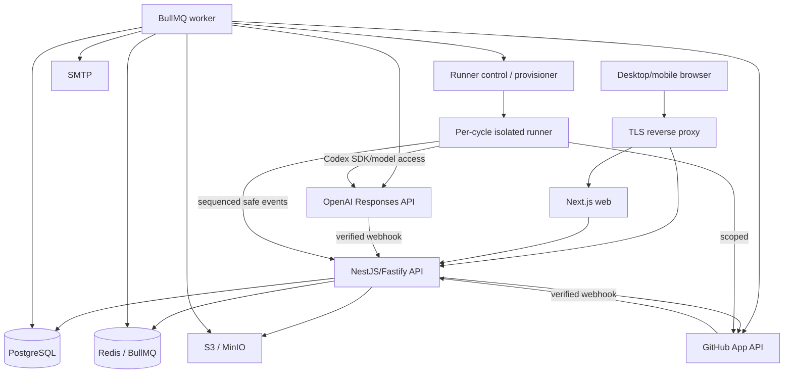
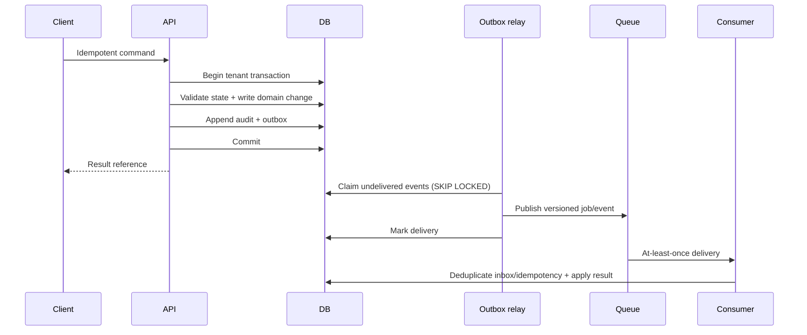
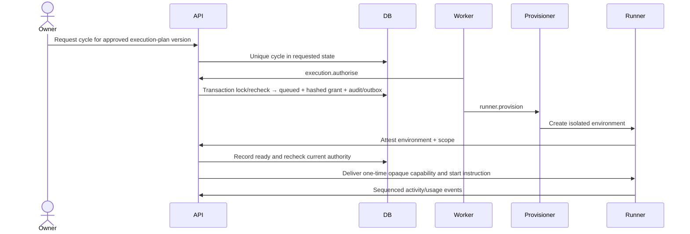
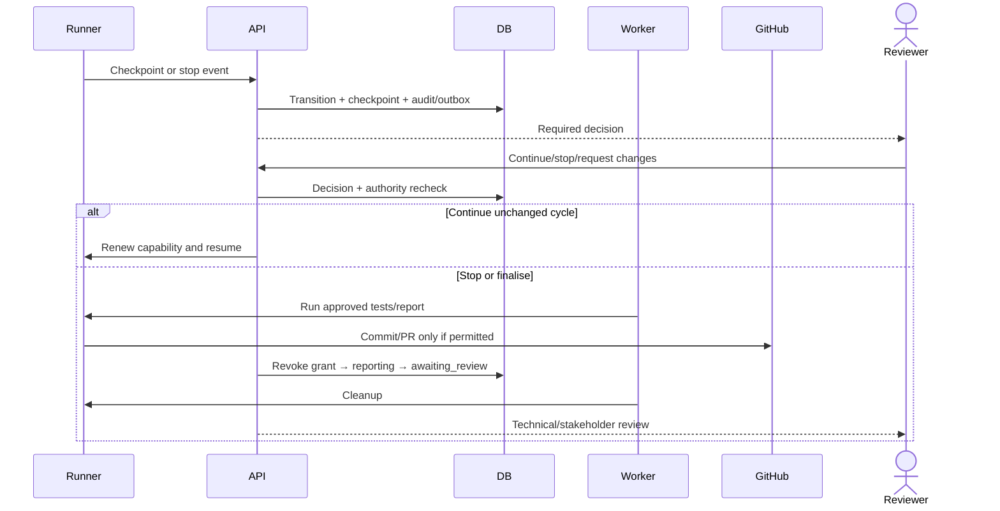
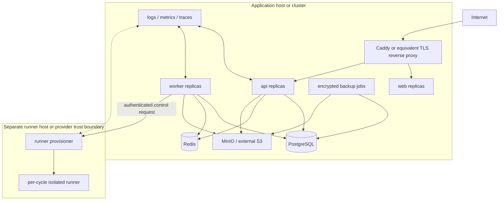

# System Architecture

Status: Proposed
Deployment priority: self-hosted production application host plus separate runner host/provider; future managed service

## Architectural style

Use a modular monolith: one source repository and database schema, several deliberately separated runtime processes, and domain modules with enforced dependency rules. This preserves transactional integrity and contributor clarity while allowing API, workers, web, and isolated runners to scale independently.

Microservices are not justified for the first hundreds of organisations. The runner is separate because it crosses a materially different trust boundary, not because it is an independently owned business service.

## Monorepo

```text
apps/
  web/       Next.js App Router UI and BFF-safe presentation only
  api/       NestJS/Fastify REST, SSE, auth boundary, application services
  worker/    BullMQ consumers, schedulers, inbox/outbox and reconciliation
  runner/    isolated Codex runtime/control client
packages/
  domain/        framework-free module models, commands, policies, events
  database/      Drizzle schema, transaction/RLS helpers, repositories, migrations
  contracts/     Zod request/event schemas and OpenAPI generation
  ai/            provider ports, prompts, schemas, evaluations
  integrations/  GitHub, SMTP, object-store adapters
  ui/            accessible design-system components
  config/        validated configuration and feature capability declarations
  testing/       fixtures, builders, Testcontainers, contract/E2E helpers
docs/
  planning/
```

Use pnpm workspaces and Turborepo for task graph, affected builds, and local caching. Do not enable remote caching initially. Pin Node/package manager versions and commit the lockfile.

## Runtime responsibilities

### `apps/web`

- Next.js App Router layouts, pages, forms, optimistic UI, responsive/accessibility behaviour.
- Server components may retrieve from the API using a delegated session, but do not own domain writes or database access.
- Client components consume REST/SSE through typed contracts.
- Safe Markdown/diff presentation and origin/approval/status UI.

### `apps/api`

- Better Auth handler at Fastify boundary, session/principal construction, CSRF/origin controls.
- REST/OpenAPI endpoints and SSE event projection.
- Application services, permission checks, transaction/RLS context, domain invariants.
- Webhook raw-body verification/inbox acceptance.
- No long AI work, repository execution, or untrusted code.

### `apps/worker`

- General AI jobs, notification/email delivery, attachment scanning orchestration.
- Transactional outbox delivery and webhook/inbox processing.
- GitHub/OpenAI reconciliation and scheduled readiness/retention jobs.
- Execution control jobs that request runner actions; never execute repository code.

### `apps/runner`

- Provisioned per cycle in an isolated environment.
- Attests capability/environment, checks out exact repo/commit, applies branch/mount/network/tool/secret policy.
- Runs Codex SDK, streams safe events, enforces local scope, runs approved tests, prepares patch/commit/report.
- Has no general tenant database credentials and cannot approve or issue/expand capabilities.

## Module dependency rules

- Domain packages do not import NestJS, Next.js, Drizzle, BullMQ, OpenAI, or GitHub libraries.
- Application modules call another module through exported commands/queries/ports, not its tables.
- `database` implements module repositories and RLS transactions; raw SQL is isolated and reviewed.
- `contracts` contains external transport schemas, not domain logic.
- `ai` and `integrations` implement ports; domain modules never depend on providers.
- `runner` depends only on runner/execution contracts and SDK/adapters needed in its sandbox.
- Circular module imports fail architecture tests/lint rules.

## Component architecture



## API style

### REST/OpenAPI

- Base path `/api/v1`.
- Resource reads use tenant/project routes and opaque UUIDs; IDs never replace permission checks.
- Behavioural state changes use explicit command endpoints (`submit`, `approve`, `request-changes`, `authorise`, `cancel`, `resume`) rather than arbitrary status patching.
- Zod schemas are the transport source of truth and generate OpenAPI.
- Commands accept `Idempotency-Key`; the server stores request hash and result reference.
- Mutable drafts/resources return `ETag`; updates require `If-Match` or explicit `lock_version` and return `409` with safe conflict context.
- Cursor pagination uses stable `(created_at,id)` or domain order keys.
- Error envelope: `{ code, message, correlationId, fieldErrors? }`; no stack/existence/tenant leakage.

Representative endpoints:

```text
POST /api/v1/organisations
POST /api/v1/projects
POST /api/v1/projects/{projectId}/invitations
POST /api/v1/projects/{projectId}/questions
POST /api/v1/questions/{questionId}/responses:submit
POST /api/v1/projects/{projectId}/ai-jobs
POST /api/v1/artifacts/{artifactId}/versions
POST /api/v1/approval-requests
POST /api/v1/approval-requests/{requestId}/decisions
POST /api/v1/projects/{projectId}/iterations
POST /api/v1/execution-plans/{planId}/versions
POST /api/v1/execution-plan-versions/{versionId}/cycles
POST /api/v1/execution-cycles/{cycleId}:cancel
POST /api/v1/execution-checkpoints/{checkpointId}/decisions
POST /api/v1/releases/{releaseId}/versions
```

### SSE

`GET /api/v1/projects/{projectId}/events` and cycle-scoped equivalents provide authorised, sanitised event projections. Each event has `id`, `type`, `version`, `occurredAt`, `aggregate`, `data`, and `correlationId`. `Last-Event-ID` resumes after reconnect; the server rechecks permission and never exposes a tenant-global stream to guests.

SSE is chosen over WebSockets initially because primary traffic is server-to-browser activity/status. Commands remain REST. Add WebSockets only if demonstrated bidirectional low-latency needs justify them.

### Webhooks

- Inbound: `/webhooks/v1/github` and `/webhooks/v1/openai` with raw-body signature verification.
- Store deduplicated inbox metadata/body reference before acknowledging.
- Process asynchronously and reconcile periodically.
- Future outbound webhooks use versioned CloudEvents-like envelopes, signed delivery, retry/dead-letter, and tenant-selected destinations.

## Transactional outbox and domain events



The outbox applies to notifications, AI jobs, readiness re-evaluation, approval staleness, runner authorisation/provisioning, tests/reports/reviews, GitHub operations, integration delivery, and retention. Redis loss must not lose authoritative intent.

## Background job architecture

Queue groups:

- `ai`: generation, extraction, conflicts, backlog, evaluation.
- `notifications`: in-app fanout, SMTP, digests.
- `integrations`: GitHub/OpenAI webhooks, reconciliation, outbound hooks.
- `attachments`: validation/scanning/quarantine/purge.
- `execution-control`: canonical runner lifecycle jobs.
- `platform`: outbox relay, readiness, retention, export/deletion, housekeeping.

Jobs carry versioned schemas, opaque IDs, correlation/causation, tenant ID for rehydration, idempotency key, and attempt metadata. Consumers open a fresh RLS transaction and reauthorise current state. Retries use bounded exponential backoff/jitter; permanent errors dead-letter with operator/user-visible recovery state.

The execution-control job names are exactly `execution.authorise`, `runner.provision`, `runner.start`, `execution.run-tests`, `execution.generate-report`, `execution.cancel`, `runner.cleanup`, `execution.request-review`, and `execution.reconcile`. Job IDs use `cycle:{cycle_id}:{stage}:{attempt}`. Cycle requests use `execution-cycle:{execution_plan_version_id}`; branch, commit and pull-request jobs reconcile durable `code_changes` intent before every retry.

## Runner control architecture

### Capability issuance and start



### Checkpoint, cancellation, report, cleanup, review



Cancellation revokes capability/secret leases before the 30-second graceful stop. Hard kill and idempotent cleanup follow. Cleanup failure creates `recovery_required` and an operator runbook action.

## Storage

### PostgreSQL

Authoritative state, transactions, RLS, versions, relationships, policies, decisions, usage, audit, inbox/outbox. One database/schema initially; module table ownership remains explicit. Use read replicas only after measured need and never for authority checks that require current state.

### Redis

BullMQ jobs/locks, ephemeral rate-limit counters, and optional short-lived cache/SSE fanout. Redis is not the source of truth for approvals, capabilities, lifecycle, audit, or integration intent. Recovery rebuilds jobs from outbox/reconciliation.

### S3/MinIO

Private objects for attachments, exports, encrypted raw AI/runner output, patches, reports, and large webhook payloads. Database stores tenant/project ownership, object key, hash, scan/quarantine, retention, and deletion state. Access uses short-lived signed URLs issued after permission checks.

## Caching

- Cache public/static configuration and tenant-safe read projections only.
- Every key includes organisation and relevant actor/permission version.
- Do not cache approval validity, current authority, capability status, or runner start decisions across transactions.
- Invalidate by committed outbox events; TTL is a fallback, not correctness.

## Authentication integration

Better Auth is mounted directly at the Fastify boundary using its Drizzle adapter and stable first-party plugins for magic link/MFA as selected. Do not couple controllers to a community Nest guard package. Convert verified sessions into an internal principal; the permission service and RLS context remain application-owned. OIDC/SAML/SCIM are later adapters.

## UI system and screen ownership

The product information architecture and measurable UX acceptance criteria are owned by [Product Requirements](01-product-requirements.md). `packages/ui` supplies accessible primitives and patterns; feature screens remain in `apps/web` and consume domain contracts.

- shadcn/Radix primitives with Tailwind tokens.
- WCAG 2.2 AA, visible focus, keyboard-first command order, semantic live regions for status/SSE.
- Safe Markdown and specialised evidence/diff/approval/activity views.
- Progressive disclosure based on project mode and user task, not role-based hiding of required evidence.

## Deployment topology

### Initial self-hosted production



Docker Compose is the first supported operator path on Linux for the application services, with a separately authenticated runner host/provider for controlled execution. A single-host Compose layout is development-only or an explicitly reduced-isolation self-host choice and does not satisfy the recommended production runner boundary. Production documentation requires TLS, secrets, persistent volumes/external services, mail, GitHub/OpenAI credentials, backups, restore, upgrade, resource limits, health probes, mutual runner-control authentication, and runner containment. Development uses Mailpit/test credentials and local MinIO/PostgreSQL/Redis.

### Scaling path

- Scale stateless web/API and workers horizontally.
- BullMQ queue partitioning by work class, not tenant-specific infrastructure initially.
- PostgreSQL tuning/indexing/partition audit and outbox tables; read replicas for safe projections later.
- External S3/managed PostgreSQL/Redis optional without changing contracts.
- Runner pools by trust/risk profile; managed hostile multi-tenancy requires microVM-class isolation and independent security validation.
- Extract a module into a service only when ownership, scaling, failure isolation, or regulatory boundary is proven and a stable port/event contract exists.

## Observability

- Pino-compatible structured JSON logs with correlation, causation, tenant/project opaque IDs, runtime, module, job/cycle, and safe error code.
- OpenTelemetry traces across HTTP, DB, queue, provider, GitHub, and runner-control boundaries.
- Metrics: latency/error/saturation, DB pool/query, RLS denials, outbox lag, queue age/retries/dead letters, webhook reconciliation, AI cost/tokens, capability/revocation, runner provision/start/cleanup, denied actions, cycle duration/stop reasons, backup freshness/restore result.
- Sentry-compatible error sink optional; sensitive content redacted before export.
- Health: liveness for process, readiness for required dependencies, dependency-specific diagnostics restricted to operators.

## Migration and release operations

- Drizzle schema as TypeScript mapping; reviewed SQL migration is executable authority.
- Migration CI applies from empty and prior supported releases, checks drift, and exercises rollback/forward recovery.
- Use expand/backfill/switch/contract; background backfills are idempotent and observable.
- Web/API/worker compatibility spans the migration window.
- Back up before high-risk migration and prove restore quarterly.

## Alternatives considered

| Alternative | Decision |
|---|---|
| Next.js full-stack only | Rejected: domain/worker/public API boundaries and runner control benefit from explicit NestJS API. |
| Microservices | Rejected initially: excessive distributed consistency/operations for small scale. |
| Nx | Rejected initially: Turborepo supplies sufficient task orchestration with less policy surface. |
| pnpm scripts only | Not selected: several apps/packages justify a small task graph/cache. |
| Prisma | Not selected: Drizzle plus reviewed SQL gives closer SQL/RLS/control alignment. |
| Generic JSON artifact table | Rejected: weak constraints/queryability; common root plus typed extensions chosen. |
| GraphQL/tRPC | Rejected initially: REST/OpenAPI supports guests, public integrations, commands, and long-term clients clearly. |
| WebSockets for all activity | Deferred: SSE + REST meets initial one-way activity/command shape. |
| Keycloak from day one | Deferred: operationally heavy for two-person self-hosting; enterprise IdP integration remains a port. |
| Repository execution in BullMQ worker | Rejected: violates runner trust boundary and increases blast radius. |
| Provider-hosted prompt objects | Rejected: prompts remain code-versioned and evaluated with the application. |
| Separate schema/database per tenant | Deferred: operational overhead; shared schema with composite keys/RLS fits initial scale. |
| Legal electronic signature in core Project approval | Rejected for initial release: Project approval is complete; the legal ceremony is a separate future concern. |
